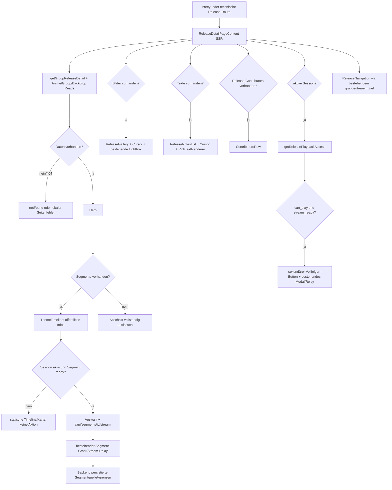

# Phase 105: Responsive Release-Detailseite und Kara-Timeline-Redesign - Research

**Researched:** 2026-07-19
**Domain:** Next.js-App-Router-Komposition, responsive Public-UI, zugängliche Kara-Timeline und lokaler Media-Player-Zustand
**Confidence:** HIGH

<user_constraints>
## User Constraints (from CONTEXT.md)

### Locked Decisions

#### Seitendramaturgie und Hierarchie
- **D-01:** Die sichtbare Reihenfolge lautet Hero → Karas → Bilder → Teamtexte → exakt diesem Release zugeordnete Fansubber → optionales vollständiges Episoden-Playback → vorheriger/nächster Release.
- **D-02:** Zwischen Hero und Kara-Sektion steht keine separate Sprungnavigation. Falls die bestehende Navigation `Bilder`, `Texte`, `Fansubber` erhalten bleibt, wird sie in den Hero-Footer integriert oder erst nach der Kara-Sektion gezeigt.
- **D-03:** Leere Bereiche bleiben wie in Phase 103 vollständig ausgelassen; das Verschieben der Karas erzwingt keinen leeren Platzhalter.
- **D-04:** Die Seite bleibt eine redaktionelle Fansub-Release-Dokumentation. Die vollständige Episode bleibt eine selten sichtbare, untergeordnete Zusatzfunktion.

#### Desktop-Kara-Timeline
- **D-05:** Auf Desktop füllt der Kara-Bereich die verfügbare Inhaltsbreite. Die heutige schmale linke Inhaltsspalte mit großer leerer rechter Fläche entfällt.
- **D-06:** Eine echte horizontale Timeline bildet `00:00` bis zur Episodendauer ab. Sie zeigt eine ruhige Grundspur, lesbare Zeitmarken und farblich unterscheidbare Segmente für OP, ED, IN, Middle und sonstige Kara-Typen.
- **D-07:** Segmentposition und -dauer bleiben fachlich proportional. Kleine Segmente erhalten außerhalb der eigentlichen Spur eine lesbare Typ-/Auswahlbeschriftung, statt als winzige runde Pillen oder irreführend breite Zeitblöcke dargestellt zu werden.
- **D-08:** Unter der Timeline stehen bei ausreichender Breite zwei polierte Segmentkarten nebeneinander. Jede Karte zeigt Typ, Segmentname, Start–Ende, Dauer, beteiligte Personen und eine Team4s-Abspielaktion.
- **D-09:** Auswahl auf Timeline oder Karte hebt genau ein Segment deutlich hervor. Der große Player erscheint unmittelbar im Kara-Bereich unter Timeline/Auswahl; beim Segmentwechsel stoppt der bisherige Stream.

#### Tablet- und Mobile-Darstellung
- **D-10:** Tablet behält ab dem geeigneten bestehenden Breakpoint die horizontale Timeline, verwendet aber weniger Zeitmarken. Segmentkarten stehen bei ungefähr 1024 px zweispaltig und bei schmalem Tablet einspaltig, ohne horizontalen Überlauf.
- **D-11:** Mobile zeigt keine zusammengedrückte horizontale Episodenleiste. Der Abschnitt heißt kurz `Karas` und verwendet eine vertikale Liste vollständig anklickbarer Segmentkarten.
- **D-12:** Mobile Karten zeigen eine farbige Typ-Seitenlinie, Typ, Name, Start–Ende, Dauer und Beteiligte. Die Abspielaktion ist mindestens 48 px hoch und nutzt den globalen Button mit Play-Icon.
- **D-13:** Kleine Segment-Vorschaubilder werden auf Mobile nicht gezeigt. Ein Medienbild ist nur zulässig, wenn es als ausreichend große, tatsächlich erkennbare Vorschau in die Player-/Detailfläche integriert wird.

#### Wiedergabe- und Zustandsdarstellung
- **D-14:** Gäste sehen Timeline beziehungsweise mobile Segmentkarten und alle öffentlichen Segmentinformationen, aber keine Abspielaktion und keinen Login-Hinweis. Phase 105 führt keinen gesperrten Werbe-Button ein.
- **D-15:** Jeder eingeloggte Nutzer kann technisch bereite Kara-Segmente über den bestehenden Phase-103-Stream-Seam abspielen. Die UI bildet diese Berechtigung nicht lokal neu nach.
- **D-16:** Noch nicht bereite Segmente bleiben sichtbar. Eingeloggte Nutzer sehen den ruhigen Text `Noch nicht abspielbar`; technische Diagnosen bleiben außerhalb der Public-Seite.
- **D-17:** Das vollständige Episoden-Playback bleibt nur bei positiv aufgelöstem Recht sichtbar und wird nach den zentralen Inhaltssektionen platziert. Sein Verhalten und seine Rechte werden in dieser Phase nicht neu entworfen.

#### Bilder, Texte und Release-Beteiligte
- **D-18:** Bilder bleiben in einem gemeinsamen responsiven Raster auf derselben Seite. Es werden keine vier getrennten Kategorie-Kapitel und keine Bilder-Unterseite wiedereingeführt.
- **D-19:** Jedes Bild bleibt als Ganzes anklickbar und öffnet die vorhandene Originalansicht. Kategorie und Uploader/Autor sind als erkennbare Badges beziehungsweise Metadaten sichtbar; lange Beschreibungen werden in der Rasterkarte gekürzt.
- **D-20:** Das Bilderraster nutzt die Breite sinnvoll: auf Desktop drei bis vier Spalten je nach verfügbarer Kartenbreite, auf Tablet zwei bis drei und auf Mobile zwei. Die exakte Spaltenzahl folgt vorhandenen Breakpoints und einer ausreichend erkennbaren Bildgröße.
- **D-21:** Teamtexte bleiben nach Rolle gegliedert und vollständig auf derselben Seite. Desktop nutzt ein echtes responsives Rollenraster beziehungsweise ergänzende Metaflächen, damit lesbare Zeilenlänge nicht als große ungenutzte rechte Halbseite erscheint. Tablet und Mobile wechseln auf eine Spalte.
- **D-22:** Lange Texte dürfen in der Karte zunächst gekürzt sein und werden mit `Weiterlesen`/`Weniger anzeigen` am selben Ort vollständig geöffnet; es entsteht keine Text-Unterseite.
- **D-23:** Release-Beteiligte bleiben eine eigene Sektion und zeigen ausschließlich die Personen dieser Release-Version mit ihren konkreten Rollen. Projektweite oder gruppenweite Mitglieder dürfen nicht als Ersatz erscheinen.

#### Hero, Navigation und visuelle Sprache
- **D-24:** Der Hero behält Preview-Bild beziehungsweise Anime-Logo-Fallback, Release-Titel, Episode, Gruppe(n) und die wichtigsten Release-Fakten. Primäre Fakten bleiben sofort sichtbar; umfangreiche sekundäre Technikdetails dürfen in einem klar beschrifteten `Details`-Bereich liegen.
- **D-25:** Release-Seite und ihre Inhaltssektionen verwenden dieselbe öffentliche Maximalbreite wie Fansub- und Fansub-Projektseite. Verschachtelte Karten erzeugen keine abweichende schmale Desktop-Spalte.
- **D-26:** Vorheriger/nächster Release liegt auf allen Breakpoints im normalen Seitenfluss am Seitenende. Die Navigation darf nicht über Karten schweben, Inhalte überdecken oder wie ein losgelöstes Floating-Element wirken.
- **D-27:** Buttons, Karten, Badges, SectionHeader und AdjacentNavigation verwenden vorhandene `@/components/ui`-Primitives beziehungsweise erweitern deren bestehenden Seam. Native Standardbuttons wie der aktuelle `Abspielen`-Button sind nicht das Zielbild.
- **D-28:** Deutsche UI-Texte verwenden korrekte Umlaute. Fokuszustände, Tastaturbedienung, Kontrast und Touch-Ziele werden für Timeline, Karten, Player und Navigation mitgeprüft.

#### Verifikation
- **D-29:** Live-UAT prüft mindestens Mobile um 390 px, Tablet Portrait um 768 px, Tablet/Laptop um 1024 px und Desktop um 1440 px. Kein Breakpoint darf horizontal überlaufen.
- **D-30:** UAT umfasst Gast, eingeloggten normalen Nutzer beziehungsweise Fansubber und vorhandenen berechtigten Episoden-Nutzer. Segmentwechsel, nicht bereite Segmente, fehlende Bilder/Texte und vorherige/nächste Navigation werden ebenfalls geprüft.

### the agent's Discretion
- Exakte Type-Farbpalette innerhalb der vorhandenen Media-/Public-Tokens, Anzahl und Position der Desktop-/Tablet-Zeitmarken sowie subtile Auswahl-/Player-Übergänge.
- Ob die optionale Abschnittsnavigation vollständig entfällt oder nach der Kara-Sektion kompakt erhalten bleibt, solange D-02 erfüllt ist.
- Exakte Karten-Mindestbreiten innerhalb der gelockten responsiven Darstellung und vorhandenen Team4s-Breakpoints.

### Deferred Ideas (OUT OF SCOPE)
- Eine eigenständige Media-Rechte-Verwaltungsoberfläche für globale, Gruppen-, Projekt- und Release-Grants bleibt eine separate Folgephase.
- Neue Segment-Renderdiagnosen, neue Player-/Galerie-Unterseiten und neue Media-/Release-Datenmodelle sind nicht Teil dieses Redesigns.
- Allgemeine Redesigns der Fansub- oder Anime-Seite außerhalb der für Konsistenz nötigen Vergleichsprüfung bleiben außerhalb von Phase 105.

#### Reviewed Todos (not folded)
- Die automatisch gematchten Profil-Hub-, Contribution-Primitive-, Member-Profil-, Admin-Fansub- und Achievement-Todos teilen nur allgemeine UI-/Redesign-Begriffe und gehören nicht zur Release-Detailseite.
- `Kollaboration public handling neu loesen` wird nicht gefaltet; der für Releases relevante Kooperations- und Gruppenkontext ist bereits in Phase 102/103 entschieden.
</user_constraints>

<phase_requirements>
## Phase Requirements

| ID | Description | Research Support |
|----|-------------|------------------|
| Phase 103 D-01, D-06 | Release-Seite bleibt redaktionelle Fansub-Dokumentation in der globalen Public-UI-Sprache. | Bestehende `ReleaseDetailPageContent`-Komposition, globale UI-Primitives und Public-Breitenvertrag sind als konkrete Reuse-Seams kartiert. [VERIFIED: `103-CONTEXT.md`, `105-CONTEXT.md`, codebase inspection] |
| Phase 103 D-15–D-22 | Episodenweite, release-gebundene Kara-Timeline; öffentliche Infos für Gäste; aktive Sessions spielen bereite Segmente; alte Streams werden gestoppt. | `ThemeTimeline.tsx`, Session-Seam, Segment-Relay, Deep-Link und Cleanup wurden bis auf Test- und Zustandslücken vollständig inventarisiert. [VERIFIED: `ThemeTimeline.tsx`, `useAuthSession.ts`, segment relay code, `103-VERIFICATION.md`] |
| Phase 103 D-33–D-36 | Vorher/Nächster bleibt versions- und gruppentreu. | `ReleaseNavigation.tsx` verwendet bereits `buildFansubReleaseHref`; der Plan darf nur Darstellung/Flow ändern, nicht Zielauflösung. [VERIFIED: `ReleaseNavigation.tsx`, `ReleaseNavigation.test.tsx`] |
| Phase 102 responsive Public-UI | Desktop, Tablet und Mobile werden separat geprüft; vorhandene Seams werden wiederverwendet; leere Sektionen werden lokal ausgelassen. | Breakpoints, globale Public-Tokens, vorhandene mobile Timeline und verbindliche UAT-Viewports sind dokumentiert. [VERIFIED: `102-CONTEXT.md`, `docs/frontend/ui-system.md`, `105-UI-SPEC.md`] |
| Phase 105 D-01–D-30 | Gelockte Reihenfolge, vollbreite responsive Timeline, gemeinsame Gallery, Rollenraster, eigene Beteiligtensektion, sekundäre Vollfolge und Inline-Navigation. | Exakte aktuelle Abweichungen, Dateigrenzen, Testlücken und verifizierbare Zielmuster stehen in den folgenden Abschnitten. [VERIFIED: `105-CONTEXT.md`, `105-UI-SPEC.md`, codebase inspection] |
</phase_requirements>

## Project Constraints (from AGENTS.md)

- Diese Arbeit ist ausdrücklich GSD-/planungsbezogen; Anwendungscode darf während der Recherche nicht implementiert werden. [VERIFIED: `AGENTS.md`]
- Vor jeder neuen Komponente, jedem Hook, Helper, Service, Endpoint oder DTO muss nach einem bestehenden oder nahen Äquivalent gesucht werden; passende Seams werden erweitert, nicht parallel dupliziert. Plan-Tasks müssen die relevanten Analogdateien in `read_first` nennen. [VERIFIED: `AGENTS.md`, `docs/engineering/implementation-contract.md`]
- Anime und Episoden bleiben neutral. Release-Version-Inhalte gehören zur echten `release_version_id`; `release_version_groups.fansub_group_id` ist kanonisch; `release_media` darf nicht als Ersatz für `release_version_media` verwendet werden. Phase 105 darf keine Media-Ownership ändern. [VERIFIED: `AGENTS.md`, `docs/architecture/db-schema-fansub-domain.md`]
- Eine unerwartet erforderliche API-/DTO-Änderung muss zuerst gegen `shared/contracts/openapi.yaml`, fokussierte Contracts, Backend-Runtime, `frontend/src/types/*` und `frontend/src/lib/api.ts` geprüft und im selben Änderungsschnitt synchronisiert werden. Die aktuelle Forschung findet keinen solchen Bedarf. [VERIFIED: `AGENTS.md`, `docs/api/api-contracts.md`, codebase inspection]
- Normale UI darf keine Token lesen, Bearer-Header bauen oder Keycloak-Refresh direkt ausführen. Aktive Session bedeutet `hasAccessToken || hasRefreshToken`; der zentrale Client/Relay bleibt Eigentümer von Refresh und Stream-Handoff. [VERIFIED: `AGENTS.md`, `docs/frontend/auth-api-client.md`]
- User-facing deutsche Texte verwenden echte Umlaute; ASCII-Ersatzformen sind unzulässig. [VERIFIED: `AGENTS.md`]
- Vorhandene `@/components/ui`-Primitives sind für Buttons, Cards, Badges, Accordion, Modal, SectionHeader und AdjacentNavigation zu verwenden oder minimal zu erweitern; Domain-Geometrie bleibt lokal. [VERIFIED: `AGENTS.md`, `docs/frontend/ui-system.md`, `105-UI-SPEC.md`]
- UI-Zustände bleiben sektional/lokal; responsive Layouts dürfen keine Race Conditions, Überlagerungen oder horizontalen Überläufe erzeugen. Große unverbundene Redesigns sind ausgeschlossen. [VERIFIED: `AGENTS.md`, `105-CONTEXT.md`]
- Live-UAT erfolgt bevorzugt im gemeinsamen Codex-Browser über den echten sichtbaren Navigationspfad; Playwright/headless wäre nur Zusatzbeleg. Exakte lokale Route ist anklickbar bereitzustellen. [VERIFIED: `AGENTS.md`]
- Änderungen müssen klein und fokussiert bleiben; breite Formatierung und unverbundene Refactors sind verboten. Relevante Tests, Typecheck, Lint, Build falls machbar und `git diff --check` sind auszuführen. [VERIFIED: `AGENTS.md`]
- Falls die Phase wider Erwarten Datenbankmigration, unklare persistierte Ownership, neue Sicherheits-/Schemaentscheidung oder Datenzuordnung zur falschen Domain-Entität erfordert, muss die Ausführung stoppen und die Abweichung melden. [VERIFIED: `AGENTS.md`]

## Summary

Phase 105 benötigt keine neue Route, kein neues DTO, keinen neuen Endpoint und keine neue Player-/Media-Welt. Der bestehende gemeinsame Loader `ReleaseDetailPageContent` bedient bereits die technische und die Pretty-Route, `ThemeTimeline` besitzt Deep-Link, Stream-URL, Auswahl und Cleanup, Gallery/Notizen besitzen ihre Cursor-Seams, und `ReleaseEpisodePlayer` besitzt den zentralen Refresh-/Entitlement-Pfad. Der richtige Plan ist deshalb eine gezielte Neuordnung und Härtung dieser vorhandenen Komponenten, nicht ein Neuaufbau. [VERIFIED: codebase inspection; `105-CONTEXT.md`; `105-UI-SPEC.md`]

Die aktuelle Implementierung weicht jedoch in mehreren verhaltensrelevanten Punkten vom freigegebenen Vertrag ab: `ThemeTimeline` steht nach Gallery und Texten; der Hero enthält weiterhin die Sprungnavigation und versteckt Primärfakten sowie Beteiligte im Accordion; der echte Page-Aufruf übergibt `groups`, wodurch Gallery und Notizen nach Herkunftsgruppe statt als gemeinsames Bildraster beziehungsweise Rollenraster erscheinen; Teamtexte sind dauerhaft gekürzt; Beteiligte werden pro Rollenpaar statt pro Person aggregiert; und der aktuelle Kara-Test erwartet eine Gast-Abspielaktion. Diese Punkte müssen als RED-Regressionen vor oder zusammen mit der Umsetzung festgeschrieben werden. [VERIFIED: `releaseDetailPageData.tsx`, `ReleaseDetailHero.tsx`, `ReleaseGallery.tsx`, `ReleaseNotesList.tsx`, `ContributorsRow.tsx`, `ThemeTimeline.test.tsx`]

Die technisch sauberste Grenze ist: Seitenkomposition/Hero/Beteiligte/Vollfolge/Navigation bleiben in den vorhandenen Dateien und `page.module.css`; die deutlich wachsende Timeline-Darstellung erhält ein komponentenlokales `ThemeTimeline.module.css`, während Zustand und Geometrie in `ThemeTimeline.tsx` bleiben. Gallery und Notizen behalten ihre eigenen CSS Modules. So kann die Timeline ohne globale Designsystem- oder Contract-Änderung gebaut und separat geprüft werden. [VERIFIED: codebase structure, Next.js CSS Modules documentation, `docs/frontend/ui-system.md`]

**Primary recommendation:** Plane zuerst verhaltensorientierte Tests für DOM-Reihenfolge, Sessionmatrix und proportionale Timeline; implementiere dann Shell/Hero und Timeline sequenziell, Gallery/Notizen als separaten CSS-/Komponentenschnitt und schließe mit echtem Browser-UAT bei 390/768/1024/1440 px ab. [VERIFIED: `105-UI-SPEC.md`, existing Vitest infrastructure, `AGENTS.md`]

## Architectural Responsibility Map

| Capability | Primary Tier | Secondary Tier | Rationale |
|------------|-------------|----------------|-----------|
| Route-Auflösung und Public-Aggregat | Frontend Server (SSR) | API / Backend | Pretty- und technische Route delegieren an `ReleaseDetailPageContent`; der bestehende Public-Read liefert bereits alle Displaydaten. [VERIFIED: both `page.tsx` routes, `releaseDetailPageData.tsx`] |
| Sichtbare Abschnittsreihenfolge und Leerauslassung | Frontend Server (SSR) | Browser / Client | Die Server-Komposition bestimmt DOM-Reihenfolge; Client-Komponenten geben bei leeren Datensätzen lokal `null` zurück. [VERIFIED: `releaseDetailPageData.tsx`, section components] |
| Responsive Seiten-, Grid- und Timeline-Darstellung | Browser / Client | CDN / Static | CSS Modules und globale Tokens bestimmen die Breakpoints; keine JavaScript-Viewport-Abfrage soll die eigentliche Layoutform wählen. [VERIFIED: `105-UI-SPEC.md`, Next.js CSS Modules docs] |
| Kara-Auswahl und Player-Lebenszyklus | Browser / Client | Frontend Server Relay / Backend | Lokaler React-Zustand steuert Auswahl/Fehler/Cleanup; Bytes laufen unverändert über `/api/segments/[id]/stream` und den bestehenden gebundenen Grant-Seam. [VERIFIED: `ThemeTimeline.tsx`, segment relay code] |
| Kara-Sessiondarstellung | Browser / Client | zentraler Auth/API-Client | `useAuthSession` entscheidet nur, ob Aktionen gezeigt werden; Token-/Refresh- und Grantlogik bleiben außerhalb der Komponente. [VERIFIED: `docs/frontend/auth-api-client.md`, `useAuthSession.ts`, `105-UI-SPEC.md`] |
| Gallery-Lightbox und Nachladen | Browser / Client | API / Backend | `ReleaseGallery` hält lokalen Reveal-/Fehlerzustand und nutzt `getGroupReleaseImages` sowie die bestehende `FansubMediaLightbox`. [VERIFIED: `ReleaseGallery.tsx`] |
| Teamtext-Aufklappen und Nachladen | Browser / Client | API / Backend | `ReleaseNotesList` hält lokalen ID-basierten Aufklapp-/Cursorzustand und rendert über `RichTextRenderer`. [VERIFIED: `ReleaseNotesList.tsx`, `105-UI-SPEC.md`] |
| Vollfolgenrechte und Wiedergabe | API / Backend | Browser / Client + Frontend Relay | Der zentrale Resolver liefert `can_play && stream_ready`; die UI zeigt nur die sekundäre Aktion und verändert keine Rechte. [VERIFIED: `ReleaseEpisodePlayer.tsx`, Phase-103 verification] |
| Vorheriger/nächster Release | API / Backend | Frontend Server / Client navigation | Zielauflösung kommt aus dem Public-Aggregat; `buildFansubReleaseHref` bewahrt den Pretty-/Gruppenkontext, `AdjacentNavigation` rendert inline. [VERIFIED: `ReleaseNavigation.tsx`, `ReleaseNavigation.test.tsx`] |

## Standard Stack

### Core

| Library | Version | Purpose | Why Standard |
|---------|---------|---------|--------------|
| Next.js | 16.1.6 installiert; Registry-Latest 16.2.10; Projektversion publiziert 2026-01-27 | App Router, Server-Komposition, Route-Handler und CSS-Module-Support | Bestehender Projektstandard; Phase 105 braucht keinen Framework-Upgrade. [VERIFIED: `npm ls`, `npm view`, `frontend/package.json`] |
| React / React DOM | 18.3.1 installiert; Registry-Latest 19.2.7; Projektversion publiziert 2024-04-26 | Lokaler Auswahl-, Disclosure-, Lade-, Fehler- und Mediaelement-Zustand | Bestehender Runtime-Vertrag; Upgrade wäre außerhalb des UI-Schnitts. [VERIFIED: `npm ls`, `npm view`, `frontend/package.json`] |
| CSS Modules + globale CSS-Tokens | Next.js-integriert | Breakpoints, Grids, Timeline-Geometrie, Typfarben und komponentenlokale Styles | Das Projekt nutzt bereits `.module.css`; Next.js dokumentiert lokale Namensräume ohne Zusatzpaket. [CITED: https://github.com/vercel/next.js/blob/v16.1.6/docs/01-app/01-getting-started/11-css.mdx] |
| Team4s `@/components/ui` | projektintern | `Button`, `Card`, `Badge`, `Accordion`, `Modal`, `SectionHeader`, `AdjacentNavigation` | Verbindliche globale UI-Schicht; Fachlogik bleibt in Release-Komponenten. [VERIFIED: `docs/frontend/ui-system.md`, component inspection] |

### Supporting

| Library | Version | Purpose | When to Use |
|---------|---------|---------|-------------|
| lucide-react | 0.469.0 installiert; Registry-Latest 1.25.0; Projektversion publiziert 2024-12-20 | `Play`-Icon und vorhandene Navigations-/Lightbox-Icons | Ausschließlich über die vorhandene Projektversion; keine neue Icon-Bibliothek. [VERIFIED: `npm ls`, `npm view`, codebase inspection] |
| Vitest | 3.2.4 installiert; Registry-Latest 4.1.10; Projektversion publiziert 2025-06-17 | Unit-/DOM-/SSR-Hydrationstests | Für Geometriehelper, State-Matrix, Kompositionsreihenfolge und Regressionen. [VERIFIED: `npm ls`, `npm view`, `vitest.config.ts`] |
| React Testing Library | 16.3.2 installiert und Registry-Latest; publiziert 2026-01-19 | Rollen-, Name-, Tastatur- und Zustandsabfragen | Für sichtbares Nutzerverhalten und `aria-pressed`/Button-Queries; CSS-Layout bleibt Live-UAT. [VERIFIED: `npm ls`, `npm view`; CITED: https://github.com/testing-library/testing-library-docs/blob/main/docs/queries/byrole.mdx] |
| TypeScript | 5.9.3 installiert; Registry-Latest 7.0.2; Projektversion publiziert 2025-09-30 | Typisierte Props und reine Timeline-Geometriehelper | Bestehende Lockfile-Version beibehalten; kein Compiler-Upgrade in dieser Phase. [VERIFIED: `npm ls`, `npm view`] |

### Alternatives Considered

| Instead of | Could Use | Tradeoff |
|------------|-----------|----------|
| Lokale CSS-Timeline im bestehenden `ThemeTimeline`-Seam | Externe Timeline-/Chart-Library | Abgelehnt: würde neue Abhängigkeit, fremde Interaktionssemantik und unnötige API erzeugen; die Daten sind einfache Prozentgeometrie und der UI-Vertrag verlangt lokale Domain-Komposition. [VERIFIED: `105-UI-SPEC.md`, codebase inspection] |
| CSS Modules und globale Tokens | Tailwind, shadcn oder zweites Designsystem | Abgelehnt: `components.json` fehlt und das interne UI-System ist gelockt. [VERIFIED: filesystem probe, `105-UI-SPEC.md`] |
| Bestehende `Button`/`Card`/`Badge`-Primitives | Native seitenlokal gestylte Buttons/Karten | Abgelehnt: aktueller nativer `Abspielen`-Button ist ausdrücklich nicht das Zielbild. [VERIFIED: `105-CONTEXT.md` D-27] |
| Separate mobile Kartenansicht per CSS | Horizontal scrollende oder zusammengedrückte Timeline | Abgelehnt: Mobile muss eine eigenständige vertikale Kara-Liste ohne Scrollspur erhalten. [VERIFIED: `105-CONTEXT.md` D-11, `105-UI-SPEC.md`] |

**Installation:** Keine neuen Pakete installieren. Reproduzierbare bestehende Installation:

```powershell
cd frontend
npm ci
```

**Version verification:** `npm ls` bestätigte die tatsächlich installierten Versionen; `npm view <package> version` bestätigte die aktuellen Registry-Versionen und `npm view <package>@<version> time` die Publikationsdaten. Die Empfehlung ist bewusst, die Lockfile-Versionen zu behalten, weil ein Dependency-Upgrade keine Voraussetzung des Redesigns ist. [VERIFIED: npm registry and local install, 2026-07-19]

## Architecture Patterns

### System Architecture Diagram

Die folgende Daten- und Zustandsflusskarte entspricht dem aktuellen Code; Phase 105 ändert nur die markierten UI-Kompositionen, nicht die API-/Relay-Grenzen. [VERIFIED: codebase inspection]



### Recommended Project Structure

```text
frontend/src/app/anime/[id]/group/[groupId]/releases/[releaseVersionId]/
├── releaseDetailPageData.tsx             # SSR-Datenkomposition und gelockte DOM-Reihenfolge
├── releaseDetailPageData.test.ts          # bestehende ID-/Deep-Link-Parsertests
├── releaseDetailPageData.composition.test.tsx # Wave-0: neue Reihenfolge-/Omission-Regression
├── ReleaseDetailHero.tsx                 # Primärfakten sichtbar; Accordion nur für Sekundärdetails
├── ThemeTimeline.tsx                     # Zustand, Geometrie, Sessionmatrix, Player-Cleanup
├── ThemeTimeline.module.css              # neu: ausschließlich Kara-Geometrie/Breakpoints/Typfarben
├── ReleaseGallery.tsx                    # ein Raster, Cursor, Lightbox, lokaler Fehler
├── ReleaseGallery.module.css             # 2/2/3/4-Spaltenvertrag
├── ReleaseNotesList.tsx                  # Rollenbuckets, ID-basiertes Aufklappen, Cursor
├── ReleaseNotesList.module.css           # 1/1/2-Rollenraster und 68ch-Körper
├── ContributorsRow.tsx                   # release-spezifische Personen-/Rollenaggregation
├── ReleaseEpisodePlayer.tsx              # unveränderter Rechte-/Relay-Seam, neue Sekundärsektion
├── ReleaseNavigation.tsx                 # explizit inline, lokal mobile gestapelt
└── page.module.css                       # Page/Hero/Contributors/Episode/Nav; keine Timeline-Details mehr
```

Diese Struktur führt nur ein lokales CSS Module und einen fokussierten Kompositionstest neu ein; sie baut weder eine neue Domain-Komponente noch einen neuen Helper-/API-Seam. [VERIFIED: project structure and implementation contract]

### Exact Existing File Findings

| File | Current seam / mismatch | Prescriptive planning consequence |
|------|-------------------------|----------------------------------|
| `releaseDetailPageData.tsx` | Rendert Gallery → Notes → Timeline und keinen top-level `ContributorsRow`; Backlink/Fehlercopy ist kürzer als UI-SPEC. [VERIFIED: source inspection] | Komponenten hier semantisch umordnen, Contributors ergänzen, `Zurück zum Fansub-Projekt` und vollständige Fehlercopy setzen; Datenreads unverändert lassen. |
| `ReleaseDetailHero.tsx` | Der komplette Summary-Block ist Accordion-Trigger; Version/Datum/Dauer/Auflösung liegen im geschlossenen Panel; Contributors und Sprungnavigation liegen noch im Hero-Seam. [VERIFIED: source inspection] | Summary außerhalb des Accordions, Primärfakten sichtbar, nur Sekundärtechnik unter `Details`, `ContributorsRow` und `releaseAnchors` entfernen. |
| `page.module.css` | Enthält Page, Hero, Contributors und Timeline zusammen; Public-Breite beginnt erst ab 769 px, Mobile-Gutter ist 14 px, mehrere Gewichte 500/600/650/800 und die Timeline verwendet eine 44-px-Pillenspur. [VERIFIED: source inspection] | Page/Hero/Contributor/Nav auf 639/900/1199-Grenzen und 400/700-Gewichte ausrichten; Timeline-Regeln in neues lokales Module verschieben. |
| `ThemeTimeline.tsx` | Ein `selected`-Objekt mountet direkt den Player; `Math.max(2, width)` verfälscht kleine Segmente; Gäste erhalten derzeit Buttons; Preview-Images und native Play-Buttons werden gerendert; kein `aria-pressed`, `aria-live` oder Playerfehler. [VERIFIED: source inspection] | Auswahl/Stream trennen, Sessionmatrix wiederherstellen, exakte Geometrie plus getrennte Hit-Zone, globale Primitives/Play-Icon, lokaler Fehler und a11y-State implementieren. |
| `ThemeTimeline.test.tsx` | Erster Test heißt Gast-Playback gut; Deep-Link prüft nur Autoplay bei ready; Cleanup/Refresh-only/a11y fehlen. [VERIFIED: source inspection] | Erwartung bewusst ersetzen und den Test zum Hauptvertrag für Phase-105-D05–D16/D28/D30 ausbauen. |
| `ReleaseGallery.tsx` | Ohne `groups` ein Grid, mit realen `groups` Herkunftsbuckets; bestehende Lightbox/Cursor/Dedupe-Seams sind korrekt lokal. [VERIFIED: source inspection] | Buckets entfernen, Gruppeninfo höchstens Metadatum; `FansubMediaLightbox`, `getGroupReleaseImages`, Reveal und Dedupe unverändert wiederverwenden. |
| `ReleaseGallery.module.css` | Drei Desktopspalten, zwei ≤900; keine vierte Spalte ≥1200; Abstände enthalten 10/14 px außerhalb der 4-px-Skala. [VERIFIED: source inspection] | Exakt 2 Spalten ≤900, 3 bei 901–1199, 4 ab 1200; Gap/Spacing auf UI-SPEC-Skala. |
| `ReleaseNotesList.tsx` | `groups.length` wechselt auf Herkunftsgruppen; keine per-Karte-Expansion; Cursor-/Dedupe- und UTC-Datumsseams existieren. [VERIFIED: source inspection] | Immer Rollenbuckets, Gruppenherkunft in Metazeile, `expandedNoteIDs`, vorhandenen Cursor und Datumsformat beibehalten. |
| `ReleaseNotesList.module.css` | Permanenter 6-Zeilen-Clamp, kein Expanded-Modifikator und keine 68ch-Begrenzung. [VERIFIED: source inspection] | Clamp-/Expanded-Klassen, 68ch, 1/1/2-Rollenraster und tokenkonforme Abstände ergänzen. |
| `ContributorsRow.tsx` | Mappt jedes Person-/Rollenpaar auf eigene Karte und gruppiert optional nach Fansubgruppe; mobile CSS setzt aktuell zwei Spalten. [VERIFIED: source inspection] | Paare deduplizieren, Rollen je `(fansub_group_id, member_id)` aggregieren, Mobile eine Spalte, Desktop `auto-fit` ab 220 px. |
| `ReleaseEpisodePlayer.tsx` | Zentraler Session-/Access-/Modal-/Cleanup-Seam ist korrekt, rendert im Erfolgsfall aber nur einen Button ohne eigene SectionHeader-Fläche. [VERIFIED: source inspection and tests] | Rechte-/Fetch-/Relaylogik nicht ändern; sichtbaren Erfolgsfall als sekundäre `Vollständige Episode`-Sektion komponieren. |
| `ReleaseNavigation.tsx` | Verwendet schon gruppentreuen Href-Builder; `AdjacentNavigation` ist implizit `inline`, global auf Mobile aber zweispaltig und 44 px hoch. [VERIFIED: source and UI CSS inspection] | `variant="inline"` explizit setzen, lokale Klasse für ≤639 einspaltig und ≥48 px; Zielauflösung unverändert. |
| `PublicReleaseBlock.tsx/.module.css` | Liefert Type-Farben, Randalignment, Grundspur und vertikale Karten als engsten Vergleich, verwendet aber Links, eigene Compact-Containergrenze und keine Playerzustände. [VERIFIED: source inspection] | Nur Palette/Grundspur/mobile Struktur als Pattern lesen; weder Komponente kopieren noch ihre 820-px-Containergrenze auf die Detailseite übertragen. |

Diese Tabelle gehört in die `read_first`-Grundlage der späteren PLAN-Dateien; insbesondere dürfen `PublicReleaseBlock`, Auth-Doku, UI-SPEC und die vorhandenen Tests nicht nur implizit vorausgesetzt werden. [VERIFIED: Team4s planning contract]

### Pattern 1: Server-Komposition bestimmt die semantische Reihenfolge

**What:** `ReleaseDetailPageContent` rendert die Komponenten tatsächlich in der Reihenfolge Hero → Timeline → Gallery → Notes → Contributors → Vollfolge → Navigation. CSS `order` darf nicht verwendet werden, weil DOM-, Fokus- und Screenreader-Reihenfolge identisch bleiben müssen. [VERIFIED: `105-UI-SPEC.md`, current `releaseDetailPageData.tsx`]

**When to use:** Für alle Breakpoints; einzelne leere Client-Komponenten dürfen weiterhin `null` zurückgeben. [VERIFIED: existing section pattern]

**Example:**

```tsx
// Source: 105-UI-SPEC.md + existing ReleaseDetailPageContent seam
<ReleaseDetailHero {...detail} />
<ThemeTimeline segments={detail.segments} {...playbackProps} />
<ReleaseGallery initialImages={detail.images} {...galleryProps} />
<ReleaseNotesList initialNotes={detail.notes} {...noteProps} />
<ContributorsRow contributors={detail.contributors} groups={detail.groups} />
<ReleaseEpisodePlayer releaseVersionID={detail.release_version_id} title={detail.title} />
<ReleaseNavigation previous={detail.previous} next={detail.next} {...routeProps} />
```

### Pattern 2: Fachproportion und Interaktionsziel trennen

**What:** Der sichtbare Segmentbalken verwendet exakt `left = start / duration` und `width = (end - start) / duration`; ein getrenntes, transparent erweitertes 44×44-px-Hit-Target sitzt am Segmentzentrum. Keine `min-width` darf den sichtbaren Balken fachlich verbreitern. [VERIFIED: `105-UI-SPEC.md` Kara-Timeline-Vertrag]

**When to use:** Für Desktop/Tablet-Timeline; Mobile rendert statt dieser Spur Karten. [VERIFIED: `105-UI-SPEC.md`]

**Example:**

```tsx
// Source: 105-UI-SPEC.md; proportions remain data-derived
const leftPercent = clamp((startSeconds / durationSeconds) * 100, 0, 100)
const widthPercent = clamp(((endSeconds - startSeconds) / durationSeconds) * 100, 0, 100 - leftPercent)
const centerPercent = leftPercent + widthPercent / 2

return <>
  <span aria-hidden="true" className={styles.segmentVisual} style={segmentStyle(leftPercent, widthPercent)} />
  {playable ? <button className={styles.segmentHitTarget} style={centerStyle(centerPercent)} /> : null}
</>
```

### Pattern 3: Öffentliche Auswahl und Streamzustand getrennt halten

**What:** `selectedSegmentID` steuert die sichtbare Hervorhebung und darf auch aus einem öffentlichen Deep-Link stammen. `streamSegmentID` entsteht nur nach einer aktiven Session plus `ready`-Segment und steuert den `<video>`-Mount. Damit kann ein Gast einen Deep-Link sehen, ohne dass ein Streamversuch oder eine Aktion entsteht. [VERIFIED: `105-UI-SPEC.md` Authentication Matrix and Deep-Link contract]

**When to use:** Für Timeline-Hit-Targets, Kartenwahl, CTA und Autoplay. [VERIFIED: `105-UI-SPEC.md`]

**Example:**

```tsx
// Source: docs/frontend/auth-api-client.md + 105-UI-SPEC.md
const { hasAccessToken, hasRefreshToken, isClientInitialized } = useAuthSession()
const hasSession = isClientInitialized && (hasAccessToken || hasRefreshToken)

function playSegment(segment: PublicReleaseSegment) {
  setSelectedSegmentID(segment.theme_segment_id)
  if (!hasSession || segment.readiness !== 'ready') return
  stopCurrentStream()
  setStreamSegmentID(segment.theme_segment_id)
}
```

### Pattern 4: Ein gemeinsamer Stop-Seam für Wechsel und Unmount

**What:** Pause, `src` entfernen und `load()` müssen in einer Funktion gebündelt werden, die sowohl vor dem Segmentwechsel als auch im Effect-Cleanup läuft. Fehlerzustand wird beim neuen Versuch lokal zurückgesetzt. [VERIFIED: current `ThemeTimeline.tsx`, `ReleaseEpisodePlayer.tsx`; CITED: https://github.com/reactjs/react.dev/blob/main/src/content/reference/react/useEffect.md]

**When to use:** Bei CTA, Timeline-Auswahl, Sessionverlust und Unmount. [VERIFIED: `105-UI-SPEC.md`]

```tsx
// Source: existing Team4s player cleanup pattern + React useEffect cleanup docs
function stopCurrentStream() {
  const player = videoRef.current
  if (!player) return
  player.pause()
  player.removeAttribute('src')
  player.load()
}

useEffect(() => () => stopCurrentStream(), [])
```

### Pattern 5: Rollen- und Personenaggregation vor dem Rendern

**What:** Notizen werden immer nach `role_label` gebucktet; `fansub_group_id` bleibt Metadatum der Karte. Beteiligte werden mindestens nach `(fansub_group_id, member_id)` zusammengeführt und ihre eindeutigen Rollen stabil gesammelt, damit identische Person-/Rollenpaare nicht mehrfach als Karten erscheinen. [VERIFIED: `105-UI-SPEC.md`, current DTO shape]

**When to use:** Unabhängig davon, ob `groups` an die Komponente übergeben wird; genau dieser Prop darf die primäre Gruppierungsachse nicht mehr umschalten. [VERIFIED: current runtime branch in Gallery/Notes, `105-UI-SPEC.md`]

### Pattern 6: CSS wählt Breakpoint-Layout; React hält nur Inhaltszustand

**What:** Timeline vs. mobile Karten, Spaltenzahl, Ticks und Navigation werden per CSS Media Query bestimmt. React hält Auswahl, Aufklappen, Cursor, Loading und Fehler; `responsiveGalleryReveal` darf seinen bestehenden 6/4/2-Inhaltsumfang weiter bestimmen, aber nicht die Grid-Spalten oder Timelineform. [VERIFIED: `105-UI-SPEC.md`, existing `responsiveGalleryReveal.ts`]

**When to use:** Für 390/768/1024/1440 px und Resize-UAT. [VERIFIED: `105-CONTEXT.md` D-29]

### Recommended Plan Boundaries

| Plan | Files owned | Deliverable | Dependency |
|------|-------------|-------------|------------|
| 105-01 Wave 0 | existing tests plus new `releaseDetailPageData.composition.test.tsx` | RED contracts for order, guest/refresh matrix, proportions, role/gallery grouping, text expansion, contributor dedupe and inline nav | none [VERIFIED: current test inventory] |
| 105-02 Shell/Hero | `releaseDetailPageData.tsx`, `ReleaseDetailHero*`, `ContributorsRow*`, `ReleaseEpisodePlayer*`, `ReleaseNavigation*`, `page.module.css` | Correct DOM order; primär sichtbare Hero-Fakten; separate Beteiligte/Vollfolge; no jump nav; inline mobile navigation | 105-01 [VERIFIED: integration map] |
| 105-03 Kara | `ThemeTimeline.tsx`, `ThemeTimeline.test.tsx`, new `ThemeTimeline.module.css`; read-only comparison with `PublicReleaseBlock*` | Full-width desktop/tablet track, mobile list, session-gated actions, separate selection/stream state, cleanup/error/a11y | 105-01 and after 105-02 only because current timeline CSS must be removed from `page.module.css` [VERIFIED: file overlap analysis] |
| 105-04 Content grids | `ReleaseGallery*`, `ReleaseNotesList*`, their tests/CSS | One Gallery grid, 2/2/3/4 columns, role-first notes, per-card expand/collapse, local errors | 105-01; can execute independently of 105-02/03 because files are disjoint [VERIFIED: file overlap analysis] |
| 105-05 Integration/UAT | no feature expansion; fixes only in above owners | Full focused suite, typecheck/lint/build/diff-check and live 390/768/1024/1440 state matrix | 105-02, 105-03, 105-04 [VERIFIED: `AGENTS.md`, `105-UI-SPEC.md`] |

### Anti-Patterns to Avoid

- **CSS-only visual reorder:** Es verletzt identische DOM-/Fokusreihenfolge; Komponenten im Server-Tree wirklich umordnen. [VERIFIED: `105-UI-SPEC.md`]
- **`min-width` auf dem sichtbaren Segment:** Der aktuelle `Math.max(2, ...)`-Pfad verbreitert kleine Segmente fachlich falsch; nur Hit-Target vergrößern. [VERIFIED: current `ThemeTimeline.tsx`, `105-CONTEXT.md` D-07]
- **Gäste- oder unavailable-Controls als `disabled` Buttons:** Gäste und nicht ausführbare Segmente sollen keine bedeutungslosen Tabstopps/Lock-Werbung erhalten; statische Elemente rendern. [VERIFIED: `105-UI-SPEC.md`]
- **Nur `hasAccessToken` prüfen:** Refresh-only-Sessions würden fälschlich wie Gäste aussehen; `hasAccessToken || hasRefreshToken` verwenden. [VERIFIED: `docs/frontend/auth-api-client.md`]
- **Public-Grant oder Rechte in der Komponente nachbauen:** Der Segment-/Release-Relay und zentrale Resolver bleiben unverändert; die UI steuert Sichtbarkeit und lokalen Zustand. [VERIFIED: Phase-103 contracts]
- **`groups` als Umschalter der Hauptgruppierung:** Im realen Page-Aufruf ist `groups` nicht leer und aktiviert aktuell die falschen Herkunftsgruppen-Kapitel. Gallery bleibt ein Raster, Notizen bleiben Rollenbuckets. [VERIFIED: `releaseDetailPageData.tsx`, `ReleaseGallery.tsx`, `ReleaseNotesList.tsx`]
- **Globale Domain-Timeline-Komponente:** Typ-/Grant-/Release-Logik gehört nicht in `components/ui`; nur generische Primitives wiederverwenden. [VERIFIED: `docs/frontend/ui-system.md`]
- **JS-Viewport-Switch für Timelineform:** Erhöht Hydration-/Resize-Risiko; CSS Media Queries verwenden. [VERIFIED: Next.js CSS docs, `105-UI-SPEC.md`]
- **Neue Bilder-, Text- oder Player-Unterseite:** Ausdrücklich außerhalb des Phase-Boundary. [VERIFIED: `105-CONTEXT.md`]

## Don't Hand-Roll

| Problem | Don't Build | Use Instead | Why |
|---------|-------------|-------------|-----|
| Sessionerkennung | Cookie-/Token-Reads oder eigener Refresh-Hook | `useAuthSession()` mit `hasAccessToken \|\| hasRefreshToken` | Verhindert falschen Gastzustand und hält Token aus Komponenten. [VERIFIED: `docs/frontend/auth-api-client.md`] |
| Kara-Streamtransport | Neuer Player-Endpoint, freie Start-/Endparameter oder lokale Grantlogik | `/api/segments/[id]/stream?release_version_id=...` | Bestehender Relay bindet Release/Segment und weist freie Bounds zurück. [VERIFIED: segment relay route and tests] |
| Vollfolgenrechte | Rollenchecks oder lokale Entitlement-Hierarchie | `getReleasePlaybackAccess` + bestehender Release-Relay | Button und Backend-Streamzugriff bleiben am zentralen Resolver aus Phase 103. [VERIFIED: `ReleaseEpisodePlayer.tsx`, `103-VERIFICATION.md`] |
| Originalbild-Overlay | Neue Lightbox/Modal-Implementierung | `FansubMediaLightbox` | Fokusfalle, Escape, Navigation und Fokusrückgabe existieren bereits. [VERIFIED: `ReleaseGallery.tsx`, `FansubMediaLightbox.tsx`] |
| Rich-Text-Ausgabe | Zweiter HTML-Renderer oder clientseitiges Sanitizing | `RichTextRenderer` auf dem serverseitig sanitisierten `body_html` | Bewahrt den bestehenden TipTap-/Sanitizing-Vertrag. [VERIFIED: `ReleaseNotesList.tsx`, `backend/internal/services/tiptap_service.go`] |
| Standardaktionen/-flächen | Lokale Button-, Card-, Badge-, Header- oder Nav-Nachbauten | `Button`, `Card`, `Badge`, `SectionHeader`, `Accordion`, `AdjacentNavigation` | Fokus-, Varianten- und Designsystemzustände sind zentral vorhanden. [VERIFIED: `docs/frontend/ui-system.md`, UI component inspection] |
| Release-Zielpfade | Stringverkettung für Pretty-/technische URLs | `buildFansubReleaseHref` | Bestehende Tests sichern kanonischen Gruppenkontext und Kompatibilitätsroute. [VERIFIED: `ReleaseNavigation.tsx`, tests] |
| Responsive Timeline-Library | Canvas/Chart-/Timeline-Paket | lokale Prozentgeometrie plus CSS Modules | Die Datenform ist bereits Start/Ende/Dauer; keine zusätzliche Abstraktion ist nötig. [VERIFIED: current DTO and `105-UI-SPEC.md`] |

**Key insight:** Die schwierigen Teile dieser Phase sind Zustands- und Layoutkorrektheit an bestehenden Verträgen, nicht fehlende Infrastruktur. Neue Transport-, Auth-, Overlay- oder Designsystem-Abstraktionen würden mehr Integrationsrisiko als Nutzen erzeugen. [VERIFIED: codebase inspection and locked phase boundary]

## Runtime State Inventory

| Category | Items Found | Action Required |
|----------|-------------|-----------------|
| Stored data | Keine umzubenennenden oder zu migrierenden Werte; die Seite liest weiterhin echte `release_version_id`, vorhandene Segmente, Release-Version-Media, Notes und Contributors. [VERIFIED: `105-CONTEXT.md`, DTO/repository ownership inspection] | Keine Datenmigration; bei erkanntem Datenfeldmangel stoppen statt Schema ergänzen. |
| Live service config | Keine UI- oder Servicekonfiguration enthält einen umzubenennenden Phase-105-Bezeichner. Laufende Docker-Services liefern jedoch den derzeitigen alten Frontend-Build. [VERIFIED: config grep, `docker ps`] | Nach Implementierung Frontend kontrolliert rebuilden/restarten oder Dev-Server nutzen; keine API-/Keycloak-Konfigurationsänderung. |
| OS-registered state | Keine Task-Scheduler-, Service- oder Prozessregistrierung ist Bestandteil der Phase; die Anwendung läuft über die vorhandene Docker-Compose-Umgebung. [VERIFIED: phase boundary, Docker service inventory] | Keine OS-Registrierung ändern. |
| Secrets/env vars | Keine neue oder umbenannte Umgebungsvariable; Stream-/API-Basis und Auth-Seams bleiben unverändert. [VERIFIED: phase boundary and config grep] | Keine Secret-/Env-Migration. |
| Build artifacts | `frontend/.next` und der laufende `team4sv30-frontend`-Container existieren und werden Source-Edits nicht automatisch als finalen Produktionsbuild repräsentieren. [VERIFIED: filesystem and Docker probe] | `npm run build` beziehungsweise projektüblichen Docker-Rebuild vor Live-UAT ausführen; keine pauschale Löschung. |

Nach allen Repo-Edits kann nur der Frontend-Build/Container noch den alten visuellen Stand halten; Datenbank, externe Servicekonfiguration, OS-Registrierungen und Secrets tragen keinen umzubenennenden Phase-105-Zustand. [VERIFIED: runtime inventory above]

## Common Pitfalls

### Pitfall 1: Die Page-Props aktivieren versteckt die falsche Gruppierung

**What goes wrong:** Isolierte Tests ohne `groups` zeigen ein gemeinsames Gallery-Raster und Rollenbuckets, der reale Page-Aufruf übergibt aber `detail.groups`; dadurch verzweigen Gallery und Notes aktuell in Herkunftsgruppen-Kapitel. [VERIFIED: component tests vs. `releaseDetailPageData.tsx`]

**Why it happens:** Beide Komponenten verwenden `groups.length` als Modusschalter statt Gruppenherkunft nur als Metadatum zu behandeln. [VERIFIED: `ReleaseGallery.tsx`, `ReleaseNotesList.tsx`]

**How to avoid:** Tests müssen explizit nichtleere `groups` übergeben und trotzdem ein einziges Bildraster beziehungsweise Rollenüberschriften erwarten. [VERIFIED: `105-UI-SPEC.md`]

**Warning signs:** Überschriften `Herkunftsgruppe` teilen Gallery/Notizen in mehrere Abschnitte oder `data-testid="release-image-groups"` erscheint im realen Render. [VERIFIED: current code]

### Pitfall 2: Auswahl, Aktion und Stream sind ein einziger Zustand

**What goes wrong:** Ein Gast-Deep-Link kann einen Stream starten oder eine öffentliche Hervorhebung ist ohne Autoplay nicht möglich; bei Fehler/Sessionverlust bleibt eine alte Quelle hängen. [VERIFIED: current `ThemeTimeline.tsx` effect and UI contract]

**Why it happens:** Das aktuelle `selected`-Objekt ist zugleich Auswahl und Player-Mountsignal. [VERIFIED: `ThemeTimeline.tsx`]

**How to avoid:** `selectedSegmentID` und `streamSegmentID` trennen; Stop-Seam bei Wechsel, Sessionverlust und Unmount verwenden. [VERIFIED: `105-UI-SPEC.md`, existing cleanup pattern]

**Warning signs:** `<video>` existiert bei Gast-Deep-Link, `aria-pressed` fehlt, oder zwei Videoquellen spielen nach schnellem Wechsel. [VERIFIED: verification contract]

### Pitfall 3: Sichtbare Mindestbreite verfälscht Segmentdauer

**What goes wrong:** Kurze Karas wirken länger als sie fachlich sind. [VERIFIED: `105-CONTEXT.md` D-07]

**Why it happens:** Der aktuelle Code erzwingt `Math.max(2, proportionaleBreite)`. [VERIFIED: `ThemeTimeline.tsx`]

**How to avoid:** Exakte sichtbare Breite plus unabhängiges 44×44-px-Hit-Target; reine Geometriehelper unit-testen. [VERIFIED: `105-UI-SPEC.md`]

**Warning signs:** Alle kleinen Segmente sind gleich breite Pillen oder überschneiden sich als sichtbare Blöcke. [VERIFIED: current UI finding in `105-CONTEXT.md`]

### Pitfall 4: `disabled` ist kein Ersatz für statische Gastinformation

**What goes wrong:** Gäste erhalten funktionslose Controls, Login-Werbung oder irreführende Statusdiagnosen. [VERIFIED: `105-UI-SPEC.md` Authentication Matrix]

**Why it happens:** Ein einheitlicher Button-Tree ist leichter als zustandsabhängige Semantik. [VERIFIED: current timeline mark implementation]

**How to avoid:** Für Gast/unavailable statische Visuals/Karten rendern; Buttons nur bei aktiver Session und `ready`; `Noch nicht abspielbar` nur für aktive Session. [VERIFIED: `105-CONTEXT.md` D-14–D-16]

**Warning signs:** Gast-Timeline enthält Buttons, `disabled` oder Text mit `anmelden`, `gesperrt`, `Grant` oder Renderdiagnosen. [VERIFIED: copy contract]

### Pitfall 5: Globales `overflow-x: clip` verdeckt Layoutfehler

**What goes wrong:** Die Seite zeigt zwar keine Browser-Scrollbar, aber Fokusrahmen, Labels oder Karten werden abgeschnitten. [VERIFIED: `globals.css`, `105-UI-SPEC.md`]

**Why it happens:** `body` verwendet projektweit `overflow-x: clip`; visuelle UAT nur nach Scrollbar reicht daher nicht. [VERIFIED: `frontend/src/styles/globals.css`]

**How to avoid:** Bei jedem Zielviewport `scrollWidth/clientWidth`, Track-/Label-Bounds und sichtbare Fokusrahmen prüfen; `min-width: 0` auf Grid-Kindern und `minmax(0, 1fr)` verwenden. [VERIFIED: current project CSS patterns]

**Warning signs:** Außenlabels verschwinden, lange Metadaten verbreitern Karten oder Fokusoutline endet an einer Card-Kante. [VERIFIED: `105-UI-SPEC.md`]

### Pitfall 6: Der Hero bleibt faktisch ein großes Disclosure

**What goes wrong:** Version, Datum, Dauer und Auflösung bleiben bis zum Öffnen verborgen, und Beteiligte erscheinen doppelt beziehungsweise am falschen Ort. [VERIFIED: current `ReleaseDetailHero.tsx`]

**Why it happens:** Der gesamte Hero-Header ist aktuell der Accordion-Trigger und `facts` sowie `ContributorsRow` liegen im Panel. [VERIFIED: `ReleaseDetailHero.tsx`]

**How to avoid:** Hero-Summary außerhalb des Accordions rendern; nur Codec/Untertiteltracks unter `Details`; Beteiligte ausschließlich als Top-Level-Sektion. [VERIFIED: `105-UI-SPEC.md` Hero Contract]

**Warning signs:** `Video-Codec` ist der einzige klar erkennbare Detailwert oder `Mia` erscheint im Hero und später erneut. [VERIFIED: current tests and target contract]

### Pitfall 7: Text-Clamp ohne echten kartenspezifischen Zustand

**What goes wrong:** Lange Texte bleiben dauerhaft abgeschnitten oder ein globales Expand öffnet alle Karten. [VERIFIED: current Notes CSS, `105-CONTEXT.md` D-22]

**Why it happens:** `.cardBody` hat stets `-webkit-line-clamp: 6`; `ReleaseNotesList` besitzt keinen `expandedNoteIDs`-State. [VERIFIED: current source]

**How to avoid:** Stabilen `Set<number>` nach Note-ID verwenden, `Weiterlesen`/`Weniger anzeigen` als `Button variant="ghost"` pro Karte, Zustand beim Cursor-Merge bewahren. [VERIFIED: `105-UI-SPEC.md`]

**Warning signs:** Nachladen schließt offene Karten, Buttontext enthält ASCII-Umlautersatz oder alle Karten wechseln gemeinsam. [VERIFIED: target contract]

### Pitfall 8: Navigation sieht inline aus, bleibt auf Mobile zweispaltig

**What goes wrong:** Zwei lange Releaseziele werden bei 390 px gequetscht statt gestapelt. [VERIFIED: `AdjacentNavigation` global CSS, `105-UI-SPEC.md`]

**Why it happens:** Die globale `inline`-Variante verwendet aktuell unter 767 px weiterhin zwei Grid-Spalten. [VERIFIED: `ui.module.css`]

**How to avoid:** `ReleaseNavigation` über den vorhandenen `className`-Seam lokal auf eine Spalte ≤639 px setzen und Linkziele mindestens 48 px hoch machen; globale andere Nutzer nicht unbeabsichtigt ändern. [VERIFIED: `AdjacentNavigation.tsx`, `105-UI-SPEC.md`]

**Warning signs:** Ellipsis dominiert beide Ziele, Next/Previous stehen nebeneinander oder Navigation überlagert Content. [VERIFIED: target contract]

### Pitfall 9: Visuelle Tests werden mit jsdom überschätzt

**What goes wrong:** DOM-Tests sind grün, obwohl Grid-Spalten, Außenlabels oder Fokusrahmen bei realen Viewports überlaufen. [VERIFIED: Vitest jsdom test environment and UAT contract]

**Why it happens:** jsdom führt kein echtes Browserlayout oder Rendering aus. [CITED: https://github.com/jsdom/jsdom]

**How to avoid:** Unit-Tests prüfen Semantik, State und Geometriewerte; Live-Browser-UAT prüft 390/768/1024/1440 px einschließlich Resize und Fokus. [VERIFIED: `AGENTS.md`, `105-UI-SPEC.md`]

**Warning signs:** Ein Plan nennt nur Vitest und keinen Browser-/Viewport-Schritt. [VERIFIED: project UAT rules]

## Code Examples

Verified patterns from project and official sources:

### Zeitformat und Ticks ohne Viewport-JavaScript

```tsx
// Source: 105-UI-SPEC.md
export function formatTimelineTime(seconds: number): string {
  const safe = Math.max(0, Math.floor(seconds))
  return `${String(Math.floor(safe / 60)).padStart(2, '0')}:${String(safe % 60).padStart(2, '0')}`
}

const ticks = [0, 0.25, 0.5, 0.75, 1].map(fraction => ({
  fraction,
  label: formatTimelineTime(duration * fraction),
}))
// CSS hides 25% and 75% at 640–1199 px and the full scale at ≤639 px.
```

### Zugänglicher Auswahlzustand

```tsx
// Source: WAI-ARIA Button Pattern + 105-UI-SPEC.md
<button
  type="button"
  aria-pressed={selectedSegmentID === segment.theme_segment_id}
  aria-label={`${typeLabel}: ${segment.name}, ${startLabel} bis ${endLabel}, Dauer ${durationLabel}`}
  onClick={() => playSegment(segment)}
>
  {segment.name}
</button>
```

Native Buttons unterstützen Enter und Leertaste; `aria-pressed` kommuniziert den stabilen Zwei-Zustandswert zusätzlich zur sichtbaren Auswahl. [CITED: https://www.w3.org/WAI/ARIA/apg/patterns/button/]

### Reduzierte Bewegung

```css
/* Source: MDN prefers-reduced-motion + 105-UI-SPEC.md */
.selectableSegment {
  transition: border-color 140ms ease, background-color 140ms ease, opacity 140ms ease;
}

@media (prefers-reduced-motion: reduce) {
  .selectableSegment {
    transition: none;
  }
}
```

`prefers-reduced-motion: reduce` signalisiert den Wunsch nach weniger nicht wesentlicher Bewegung und ist der richtige Seam für das Abschalten der 120–160-ms-Übergänge. [CITED: https://developer.mozilla.org/en-US/docs/Web/CSS/Reference/At-rules/%40media/prefers-reduced-motion]

### Rollenbuckets behalten Gruppenherkunft als Metadatum

```tsx
// Source: current DTO + 105-UI-SPEC.md
const roleBuckets = [...new Set(notes.map(note => note.role_label || 'Weitere Beiträge'))]
  .map(role => ({
    role,
    items: notes.filter(note => (note.role_label || 'Weitere Beiträge') === role),
  }))

// Innerhalb der Karte: Member, konkrete Rolle, Datum und ggf. Herkunftsgruppe anzeigen.
```

## State of the Art

| Old Approach | Current Approach for Phase 105 | When Changed | Impact |
|--------------|--------------------------------|--------------|--------|
| Gallery → Texte → Kara | Hero → Karas → Gallery → Texte → Beteiligte → Vollfolge → Navigation | Phase-105-Entscheid 2026-07-19 | Editoriale Priorität und DOM-/Fokusfluss stimmen überein. [VERIFIED: `105-CONTEXT.md`] |
| 44-px-Spur mit mindestens 2 %-breiten Segmentpillen | 12-px-Grundspur, exakte sichtbare Proportion, separate 44-px-Hit-Zone und Außenlabels | Phase-105-UI-Vertrag 2026-07-19 | Kleine Segmente bleiben fachlich korrekt und bedienbar. [VERIFIED: `105-UI-SPEC.md`] |
| Mobile blendet nur die Spur aus und behält einfache Karten | Eigenständige vertikale `Karas`-Liste mit Typkante und 48-px-CTA | Phase-105-UI-Vertrag 2026-07-19 | Keine zusammengedrückte oder horizontal scrollende Episodenachse. [VERIFIED: `105-UI-SPEC.md`] |
| Hero-Accordion enthält Primärfakten und Beteiligte | Primärfakten sofort sichtbar; Accordion nur Sekundärtechnik; Beteiligte eigene Sektion | Phase-105-UI-Vertrag 2026-07-19 | Schnellere Orientierung und keine doppelte Ownership-Darstellung. [VERIFIED: `105-UI-SPEC.md`] |
| `groups` schaltet Gallery/Notes auf Herkunftskapitel | Gallery bleibt ein Raster; Notes bleiben Rollenraster; Gruppe bleibt Kartenmetadatum | Phase-105-Entscheide D-18/D-21 | Reale Coop-Page erfüllt denselben Layoutvertrag wie Ein-Gruppen-Release. [VERIFIED: `105-CONTEXT.md`, current branch behavior] |
| Notes sind dauerhaft 6 Zeilen gekürzt | ID-basiertes `Weiterlesen`/`Weniger anzeigen` pro Karte | Phase-105-Entscheid D-22 | Volltext bleibt in-place und Nachladen bewahrt Zustand. [VERIFIED: `105-UI-SPEC.md`] |
| Gast-Test erwartet `Abspielen` | Gast sieht nur Informationen; Access- oder Refresh-Session erhält Aktionen | Phase-105-Entscheide D-14/D-15 | Öffentliche Information und aktive Sessiondarstellung sind getrennt. [VERIFIED: current test vs. locked context] |

**Deprecated/outdated:**

- `Karaoke-Segmente` als Abschnittscopy wird durch `Karas` ersetzt. [VERIFIED: `105-UI-SPEC.md`]
- `releaseAnchors` zwischen Hero und Content entfällt vollständig; die UI-SPEC wählt die diskretionäre Option „keine Abschnittsnavigation“. [VERIFIED: `105-UI-SPEC.md` Seitenkomposition]
- Native `.timelinePlay`-Buttons und Segment-Thumbs in kleinen Karten werden entfernt; globale Buttons und die große Playerfläche sind der Ziel-Seam. [VERIFIED: `105-UI-SPEC.md`]
- Die aktuelle `Math.max(2, width)`-Geometrie ist für die sichtbare Timeline nicht mehr zulässig. [VERIFIED: `105-CONTEXT.md` D-07]

## Assumptions Log

| # | Claim | Section | Risk if Wrong |
|---|-------|---------|---------------|

All claims in this research were verified against locked planning documents, current code, local tool output, registry data or official documentation; no `[ASSUMED]` claim is used. [VERIFIED: research source audit]

## Open Questions

1. **UI-SPEC-Metadaten widersprechen dem Workflowstatus.**
   - What we know: `.planning/STATE.md` und der Research-Auftrag bezeichnen die UI-SPEC als approved; die Datei selbst trägt `status: draft`, `Approval: pending` und leere Checker-Checkboxen. [VERIFIED: `STATE.md`, task input, `105-UI-SPEC.md`]
   - What's unclear: Ob nur die Frontmatter/Sign-off-Markierung veraltet ist oder ein separater Checker-Artefakt fehlt. [VERIFIED: planning artifact inspection]
   - Recommendation: Für die Planung den Inhalt als verbindlich behandeln, weil Auftrag und STATE ihn explizit freigeben; vor Execution die Metadaten durch den Orchestrator normalisieren, ohne das Design neu zu diskutieren. [VERIFIED: task authority precedence]

2. **Der bestehende Segment-Relay stellt serverseitig einen anonymen Public-Grant aus.**
   - What we know: Der aktuelle Next-Relay verwendet `resolvePublicSegmentRelayTarget`, liest keine Auth-Cookies und der Backend-Handler besitzt `CreatePublicSegmentStreamGrant`; Phase 105 verlangt zugleich, dass Gäste keine UI-Abspielaktion sehen. [VERIFIED: relay route/tests, backend handler, `105-CONTEXT.md` D-14]
   - What's unclear: Nichts für diesen UI-Plan; unklar wäre nur eine künftig strengere serverseitige Login-Pflicht.
   - Recommendation: Phase 105 ändert den Relay nicht und stellt nur die gelockte Sessiondarstellung wieder her. Falls direkte anonyme Relay-Aufrufe künftig verboten werden sollen, braucht das eine eigene Security-/Contract-Entscheidung statt einen versteckten UI-Redesign-Nebeneffekt. [VERIFIED: locked no-new-API boundary]

3. **Außenlabel-Kollisionen brauchen eine konkrete lokale Strategie.**
   - What we know: Die UI-SPEC fordert Rand-Clamping und eine zweite Labelzeile bei Kollision; aktuelle Komponenten besitzen dafür keinen Helper. [VERIFIED: `105-UI-SPEC.md`, code inspection]
   - What's unclear: Die exakte Heuristik liegt im Agenten-Ermessen und hängt von realen Namen/Breiten ab. [VERIFIED: discretion in `105-CONTEXT.md`]
   - Recommendation: Im Kara-Plan einen kleinen, in `ThemeTimeline.tsx` testbaren Zwei-Lane-Greedy-Allocator vorsehen und ihn mit kurzen/langen Labels an 768/1024/1440 px live prüfen; keine globale Utility oder Library anlegen. [VERIFIED: UI contract and reuse rules]

## Environment Availability

| Dependency | Required By | Available | Version | Fallback |
|------------|------------|-----------|---------|----------|
| Node.js | Frontend-Tests/Build | ✓ | 24.14.0 | Projekt-Docker-Frontend [VERIFIED: local probe] |
| npm | Paket-/Scriptausführung | ✓ | 11.9.0 | Docker build [VERIFIED: local probe] |
| Frontend node_modules | Vitest/Typecheck/Lint | ✓ | Lockfile-Install vorhanden | `npm ci` [VERIFIED: filesystem + `npm ls`] |
| Docker | reales Stack-/Live-UAT | ✓ | 29.6.1 | lokaler `npm run dev` plus erreichbares Backend [VERIFIED: local probe] |
| Team4s Frontend | Pretty-Route-UAT | ✓ | laufender Container; `/fansubs/c-subs/fansubprojekt/vipers-creed/releases/1` antwortet HTTP 200 | `npm run dev -p 3000` [VERIFIED: HTTP probe 2026-07-19] |
| Team4s Backend | Public-/Playback-Reads | ✓ | laufender Container; Host-Port 18092, `/health` HTTP 200 | bestehender Docker-Service erforderlich [VERIFIED: Docker + HTTP probe] |
| Keycloak/DB/Redis | Auth-/Daten-UAT | ✓ | laufende Container; Keycloak/DB healthy | keine Phase-105-Ersatzimplementierung [VERIFIED: `docker ps`] |
| Browser | 390/768/1024/1440 Live-UAT | ✓ | Edge und Chrome installiert; Codex-In-App-Browser ist laut Projektworkflow bevorzugt | manuelle lokale Browserprüfung [VERIFIED: executable filesystem probe, `AGENTS.md`] |

**Missing dependencies with no fallback:** Keine. [VERIFIED: environment audit]

**Missing dependencies with fallback:** Keine; der initiale Request auf `/` lief in ein 5-s-Timeout, die echte Pretty-Release-Route antwortete danach in unter 20 s mit HTTP 200. UAT soll deshalb die konkrete Route statt einer unspezifischen Homepage-Probe verwenden. [VERIFIED: HTTP probes]

## Validation Architecture

### Test Framework

| Property | Value |
|----------|-------|
| Framework | Vitest 3.2.4 + React Testing Library 16.3.2 + jsdom [VERIFIED: `npm ls`, existing tests] |
| Config file | `frontend/vitest.config.ts` [VERIFIED: filesystem] |
| Quick run command | `cd frontend; npm test -- --run "src/app/anime/[id]/group/[groupId]/releases/[releaseVersionId]/ThemeTimeline.test.tsx"` [VERIFIED: local execution pattern] |
| Full phase suite command | `cd frontend; npm test -- --run "src/app/anime/[id]/group/[groupId]/releases/[releaseVersionId]" "src/app/fansubs/[slug]/fansubprojekt/[animeSlug]/releases/[releaseVersionId]/page.test.tsx" "src/components/fansubs/__tests__/PublicReleaseBlock.test.tsx"` [VERIFIED: test inventory] |

Die aktuelle fokussierte Acht-Dateien-Suite bestand am 2026-07-19 mit 27/27 Tests in 17.53 s; `npm run typecheck` bestand ebenfalls. Ein gezielter ESLint-Lauf über die Release-Dateien, `PublicReleaseBlock.tsx` und `AdjacentNavigation.tsx` bestand; zwei vorherige Lint-Aufrufe scheiterten ausschließlich an Windows-Glob-Escaping, nicht an Codebefunden. Die breitere vorgeschlagene Phase-Suite deckte zusätzlich Pretty-Route und `PublicReleaseBlock` ab und lief mit 36/37 Tests: Der bestehende Pretty-Route-Test mockt den inzwischen importierten Export `parseReleaseDetailSearchParams` nicht. Das ist ein klarer Wave-0-Testfixture-Fix, kein Phase-105-Produktfehler. [VERIFIED: local command output, `page.test.tsx` inspection]

### Phase Requirements → Test Map

| Req ID | Behavior | Test Type | Automated Command | File Exists? |
|--------|----------|-----------|-------------------|-------------|
| 105-D01–D04 | DOM-Reihenfolge Hero → Karas → Bilder → Texte → Beteiligte → Vollfolge → Navigation; Anchors entfernt; leere Sektionen ausgelassen | SSR/component integration | `npm test -- --run "src/app/anime/[id]/group/[groupId]/releases/[releaseVersionId]/releaseDetailPageData.composition.test.tsx"` | ❌ Wave 0 |
| 105-D05–D10 | Dauerauflösung, 0/25/50/75/100-Ticks, exakte left/width-Werte, Randalignment und Zwei-Lane-Labels | unit + component | `npm test -- --run "src/app/anime/[id]/group/[groupId]/releases/[releaseVersionId]/ThemeTimeline.test.tsx"` | ✅ erweitern |
| 105-D11–D13 | Mobile rendert `Karas`-Karten ohne Track/Thumbs; CTA benutzt globalen Button/Play und bleibt semantisch getrennt | component + CSS contract + live | gleicher ThemeTimeline-Test; Layout zusätzlich Live-UAT | ✅ erweitern |
| 105-D14–D16 | Gast: Infos, keine Aktion/kein Login/kein Status; Access- und Refresh-only: bereites Segment spielbar; unavailable: `Noch nicht abspielbar` | component | gleicher ThemeTimeline-Test | ✅ vorhandene gegenteilige Erwartung ersetzen |
| 105-D09/D30 | Genau eine Auswahl, `aria-pressed`, Deep-Link ohne Gast-Autoplay, schneller Wechsel stoppt alte Quelle, Fehler lokal/retrybar, Unmount cleanup | component | gleicher ThemeTimeline-Test | ✅ erweitern |
| 105-D17 | Vollfolge nur bei aktiver Session und `can_play && stream_ready`; Refresh-only; Close cleanup; Sektion sekundär | component | `npm test -- --run "src/app/anime/[id]/group/[groupId]/releases/[releaseVersionId]/ReleaseEpisodePlayer.test.tsx"` | ✅ erweitern um Heading/Position via composition test |
| 105-D18–D20 | Nichtleere `groups` erzeugen trotzdem genau ein Gallery-Raster; Metadaten/Lightbox/Cursor bleiben; Spaltenvertrag | component + live | `npm test -- --run "src/app/anime/[id]/group/[groupId]/releases/[releaseVersionId]/ReleaseGallery.test.tsx"` | ✅ erweitern |
| 105-D21–D22 | Nichtleere `groups` erzeugen Rollenbuckets; jede lange Note öffnet/schließt separat und bleibt nach Nachladen offen | component | `npm test -- --run "src/app/anime/[id]/group/[groupId]/releases/[releaseVersionId]/ReleaseNotesList.test.tsx"` | ✅ erweitern |
| 105-D23 | Ausschließlich gelieferte Release-Contributors; doppelte Paare entfernt; Rollen je Person aggregiert; leer = keine Sektion | unit/component | `npm test -- --run "src/app/anime/[id]/group/[groupId]/releases/[releaseVersionId]/ContributorsRow.test.tsx"` | ✅ erweitern |
| 105-D24 | Preview > Anime-Logo > text-only; Primärfakten sofort sichtbar; Details-Accordion nur Sekundärtechnik und zugänglich | component | `npm test -- --run "src/app/anime/[id]/group/[groupId]/releases/[releaseVersionId]/ReleaseDetailHero.test.tsx"` | ✅ bestehende „alles hidden“-Erwartung ändern |
| 105-D25–D29 | Public-Maxbreite, 390/768/1024/1440 ohne Überlauf/Fokus-Clipping; 2/2/3/4 Gallery; 1/1/2 Notes; Navigation mobile gestapelt | live browser; CSS source tests nur unterstützend | Manuelle UAT auf der Pretty-Route; `document.documentElement.scrollWidth <= document.documentElement.clientWidth` zusätzlich prüfen | Manual-only begründet: jsdom berechnet kein Layout [VERIFIED: test environment] |
| Phase 103 D-33–D-36 | Pretty-/technische Hrefs bleiben gruppentreu und fehlende Kante wird ausgelassen | component | `npm test -- --run "src/app/anime/[id]/group/[groupId]/releases/[releaseVersionId]/ReleaseNavigation.test.tsx"` | ✅ |
| Auth regression | Access-Token fehlt/abgelaufen, Refresh-Token gültig: Kara-Aktion und Vollfolgezugriff gehen über zentrale Seams, keine falsche Gastdarstellung | component + existing auth tests + live | ThemeTimeline + ReleaseEpisodePlayer Tests; `npm test -- --run src/lib/api.auth-refresh.test.ts` | ✅ Theme-Test erweitern; bestehender Auth-Test vorhanden |

### Sampling Rate

- **Per task commit:** der direkt betroffene Testfile-Befehl; für `page.module.css`/Komposition zusätzlich `releaseDetailPageData.composition.test.tsx`. [VERIFIED: proposed plan boundaries]
- **Per wave merge:** vollständige Phase-Suite aus der Tabelle plus `npm run typecheck` und gezielter ESLint-Lauf über die geänderten Dateien. [VERIFIED: project validation rules]
- **Phase gate:** Vollständige Phase-Suite, `npm run typecheck`, `npm run lint`, `npm run build`, `git diff --check` und Live-Browser-UAT bei 390/768/1024/1440 px müssen grün sein, bevor `$gsd-verify-work` beginnt. [VERIFIED: `AGENTS.md`, `105-UI-SPEC.md`]

### Wave 0 Gaps

- [ ] `frontend/src/app/anime/[id]/group/[groupId]/releases/[releaseVersionId]/releaseDetailPageData.composition.test.tsx` — mockt Reads/Child-Seams und beweist Reihenfolge, Entfernung von `releaseAnchors`, eigene Beteiligtensektion und Leerauslassung für Phase-105-D01–D04/D17/D23. [VERIFIED: current absence]
- [ ] `frontend/src/app/fansubs/[slug]/fansubprojekt/[animeSlug]/releases/[releaseVersionId]/page.test.tsx` — bestehenden Module-Mock um `parseReleaseDetailSearchParams` ergänzen und einen Deep-Link-Forwarding-Fall prüfen; die aktuelle breitere Baseline scheitert sonst vor Phase-105-Code. [VERIFIED: 36/37 baseline run]
- [ ] `ThemeTimeline.test.tsx` — Gast-Erwartung von „Abspielen vorhanden“ auf gelockte Matrix umstellen; Access-/Refresh-only, unavailable, Deep-Link, `aria-pressed`, Wechsel-/Unmount-Cleanup und Playerfehler ergänzen. [VERIFIED: current test gap]
- [ ] `ReleaseGallery.test.tsx` — mit nichtleeren `groups` weiterhin ein gemeinsames Raster und keine Herkunftskapitel erwarten. [VERIFIED: current test gap]
- [ ] `ReleaseNotesList.test.tsx` — mit nichtleeren `groups` Rollenbuckets sowie stabiles per-ID-Auf-/Zuklappen nach Cursor-Merge prüfen. [VERIFIED: current test gap]
- [ ] `ContributorsRow.test.tsx` — doppelte Rollenpaare und mehrere Rollen derselben Person aggregieren. [VERIFIED: current test gap]
- [ ] `ReleaseDetailHero.test.tsx` — Primärfakten vor Öffnen, Sekundärdetails nach Öffnen und keine Beteiligte im Hero prüfen. [VERIFIED: current test gap]
- [ ] `ReleaseNavigation.test.tsx` beziehungsweise kleiner CSS-Vertrag — explizite `inline`-Variante und lokaler Mobile-Stack-Seam. Echte Geometrie bleibt Live-UAT. [VERIFIED: current test gap]
- Framework install: keine; Vitest/RTL/jsdom sind vorhanden. [VERIFIED: environment audit]

### Live-UAT Matrix

| Dimension | Required cases |
|-----------|----------------|
| Viewports | 390, 768, 1024, 1440 px; zusätzlich Resize 1024 → 390 → 1440 ohne verlorenen lokalen Zustand. [VERIFIED: `105-CONTEXT.md`, `105-UI-SPEC.md`] |
| Session | Gast; normal eingeloggter Fansubber; Refresh-only ohne Access-Token; Vollfolgen-berechtigter Nutzer. [VERIFIED: auth/state contract] |
| Kara | ready/unavailable; OP/ED/IN/Middle/unknown type; kurze und kollidierende Labels; Deep-Link; schneller Wechsel; Streamfehler; Tastatur. [VERIFIED: verification contract] |
| Content | Preview, Logo-Fallback, text-only Hero; keine Karas; keine Bilder; keine Texte; viele Bilder; langer Text; ein/mehrere Gruppen; doppelte Contributorrollen. [VERIFIED: `105-UI-SPEC.md`] |
| Navigation | beide Kanten, nur eine Kante, keine Kante; Pretty-Href bleibt innerhalb Fansub-Projekt; Mobile gestapelt. [VERIFIED: Phase-103 navigation contract] |
| Accessibility | vollständige Tab-Reihenfolge; Enter/Leertaste; sichtbarer Fokus; `aria-pressed`; `aria-live`; Escape/Fokusrückgabe in Lightbox/Modal; Reduced Motion. [VERIFIED: `105-UI-SPEC.md`; CITED: https://www.w3.org/WAI/ARIA/apg/patterns/button/] |

## Security Domain

OWASP nennt ASVS 5.0.0 als aktuelle stabile Version; die unten vom GSD-Template verlangten V2–V6-Bezeichnungen entsprechen der älteren semantischen Kapitelbenennung und werden hier als Kontrollkategorien, nicht als v5-Anforderungs-IDs verwendet. Konkrete ASVS-IDs sollten bei einem Security-Audit versionspräfixiert werden. [CITED: https://owasp.org/www-project-application-security-verification-standard/]

### Applicable ASVS Categories

| ASVS Category | Applies | Standard Control |
|---------------|---------|-----------------|
| V2 Authentication | yes, preservation-only | Keine neue Anmeldung; `useAuthSession` konsumiert nur tokenfreie Sessionflags. [VERIFIED: `docs/frontend/auth-api-client.md`] |
| V3 Session Management | yes | `hasAccessToken \|\| hasRefreshToken`; zentraler Refresh; keine direkten Cookie-/Tokenreads. [VERIFIED: `docs/frontend/auth-api-client.md`] |
| V4 Access Control | yes | Kara-UI nur bei aktiver Session; Vollfolge ausschließlich nach zentralem `can_play && stream_ready`; Backend/Relay bleiben autoritativ. [VERIFIED: `105-UI-SPEC.md`, `ReleaseEpisodePlayer.tsx`] |
| V5 Input Validation | yes, unchanged | Positive Route-IDs und gebundene `release_version_id`; Relay weist freie `start`/`end`/`duration`-Parameter zurück. [VERIFIED: `parseReleaseDetailIDs`, segment relay tests] |
| V6 Cryptography | no new work | Bestehende kurzlebige signierte Grants unverändert lassen; niemals eigene Signatur/Kryptografie bauen. [VERIFIED: Phase-103 segment grant code] |

### Known Threat Patterns for Next.js/React Public Playback

| Pattern | STRIDE | Standard Mitigation |
|---------|--------|---------------------|
| UI behandelt Refresh-only als Gast und blendet legitime Aktion aus | Elevation-of-privilege logic error / Repudiation of state | `hasAccessToken \|\| hasRefreshToken`; zentraler API-Refresh; fokussierter Regressionstest. [VERIFIED: project auth rules] |
| Gast erhält durch UI versehentlich Playback-CTA/Autoplay | Information Disclosure | Aktion/Autoplay nur bei aktiver Session; Gast-Deep-Link markiert höchstens Information. Relay-Vertrag bleibt separater bestehender Boundary. [VERIFIED: `105-UI-SPEC.md`] |
| Caller erweitert Segmentgrenzen über Queryparameter | Tampering / Information Disclosure | Bestehender Relay lehnt freie Bounds ab und bindet Segment an reale Release-Version. [VERIFIED: segment route and tests] |
| Alter Stream läuft nach Segmentwechsel weiter | Denial of Service / Information Disclosure | Vor jedem Wechsel sowie bei Sessionverlust/Unmount pausieren, `src` entfernen und `load()`. [VERIFIED: UI contract and current cleanup seam] |
| Ungesäubertes Teamtext-HTML führt XSS aus | Tampering / Information Disclosure | Bestehenden `RichTextRenderer` nur mit serverseitig sanitisiertem TipTap-HTML verwenden; keinen zweiten Renderer/Client-Sanitizer einführen. [VERIFIED: `tipTap_service.go`, `ReleaseNotesList.tsx`] |
| Technische Fehler verraten Grant-/Renderdetails | Information Disclosure | Nur gelockte Public-Copy; technische Diagnosen bleiben Admin/Logs. [VERIFIED: `105-CONTEXT.md` D-16, copy contract] |
| Doppelte lokale Permissionlogik driftet vom Backend | Elevation of Privilege | Keine Rollen-/Capability-Nachbildung; `getReleasePlaybackAccess` und bestehende Relays bleiben Quelle der Wahrheit. [VERIFIED: Phase-103 contract] |

### Security Verification Gate

- ThemeTimeline-Tests müssen Gast, Access-Session und Refresh-only getrennt prüfen; kein Token-/Cookie-Identifier darf neu in Release-Komponenten erscheinen. [VERIFIED: `AGENTS.md`, auth boundary]
- `frontend/src/lib/api.no-token-boundary.test.ts` bleibt grün, wenn Auth-adjacent Dateien berührt werden. [VERIFIED: existing enforcement test]
- Segment-Relay- und Backend-Grant-Dateien sind `read_first`, aber außerhalb des Edit-Scope; jede benötigte Änderung daran ist eine Planabweichung und Security-Entscheidung. [VERIFIED: phase boundary]
- Vollfolgenaktion bleibt bei denial/unready/access error vollständig unsichtbar und Fehlerzustand lokal testbeobachtbar. [VERIFIED: existing `ReleaseEpisodePlayer` tests]

## Sources

### Primary (HIGH confidence)

- `.planning/phases/105-responsive-release-detailseite-und-kara-timeline-redesign/105-CONTEXT.md` — gelockte Produkt-/Responsive-/Playback-Entscheidungen. [VERIFIED: local file]
- `.planning/phases/105-responsive-release-detailseite-und-kara-timeline-redesign/105-UI-SPEC.md` — verbindlicher visueller, interaktiver, Copy-, Accessibility- und Verification-Vertrag. [VERIFIED: local file]
- `.planning/phases/103-ffentliche-release-detailseite-als-fansub-story-mit-rechte-g/103-CONTEXT.md`, `103-VERIFICATION.md`, `103-HUMAN-UAT.md` — bestehende Daten-/Auth-/Playback-/UAT-Verträge und Restchecks. [VERIFIED: local files]
- `.planning/phases/102-fansubprojekte-ui-schrittweise-verbessern/102-CONTEXT.md` — responsive Public-UI- und Reuse-Konventionen. [VERIFIED: local file]
- `AGENTS.md`, `docs/engineering/implementation-contract.md`, `docs/frontend/ui-system.md`, `docs/agent-guidelines-ui.md`, `docs/api/api-contracts.md`, `docs/frontend/auth-api-client.md`, `docs/architecture/db-schema-fansub-domain.md` — Projektregeln und Domain-/Contract-Grenzen. [VERIFIED: local files]
- Release-Detail-Komponenten, CSS, Tests, UI-Primitives, `PublicReleaseBlock`, Segment-/Release-Relays und DTOs — konkrete Ist-Implementierung. [VERIFIED: codebase inspection 2026-07-19]
- `/vercel/next.js/v16.1.6` via Context7 CLI — CSS Modules im App Router. [CITED: https://github.com/vercel/next.js/blob/v16.1.6/docs/01-app/01-getting-started/11-css.mdx]
- `/reactjs/react.dev/__branch__v18` via Context7 CLI — Effect-/Ref-Cleanup. [CITED: https://github.com/reactjs/react.dev/blob/main/src/content/reference/react/useEffect.md]
- `/testing-library/testing-library-docs` via Context7 CLI — Role-/Pressed-Queries und Accessibility-orientiertes Testing. [CITED: https://github.com/testing-library/testing-library-docs/blob/main/docs/queries/byrole.mdx]
- jsdom README — jsdom führt kein echtes Layout oder Rendering aus; responsive Geometrie benötigt deshalb einen realen Browser. [CITED: https://github.com/jsdom/jsdom]
- W3C WAI Button Pattern — native Button-Tastaturinteraktion und `aria-pressed`. [CITED: https://www.w3.org/WAI/ARIA/apg/patterns/button/]
- OWASP ASVS Project — aktuelle stabile ASVS-Version und Versionierungsregeln. [CITED: https://owasp.org/www-project-application-security-verification-standard/]
- npm registry and local `npm ls` — Projekt-/Registry-Versionen und Publikationsdaten. [VERIFIED: npm CLI 2026-07-19]

### Secondary (MEDIUM confidence)

- MDN `prefers-reduced-motion` — Browser-Support und semantische Verwendung des Media Features. [CITED: https://developer.mozilla.org/en-US/docs/Web/CSS/Reference/At-rules/%40media/prefers-reduced-motion]

### Tertiary (LOW confidence)

- Keine. [VERIFIED: source audit]

## Metadata

**Confidence breakdown:**

- Standard stack: HIGH — installierte/Registry-Versionen und offizielle Frameworkdokumentation wurden geprüft; keine neue Dependency. [VERIFIED: npm + Context7]
- Architecture: HIGH — alle betroffenen Komponenten, Props, API-/Relay-Seams, Tests und CSS-Breakpoints wurden direkt gelesen; die echte Pretty-Route antwortete HTTP 200. [VERIFIED: codebase + runtime probe]
- Pitfalls: HIGH — die wesentlichen Abweichungen sind konkrete aktuelle Branches/Tests oder ausdrücklich gelockte UI-Verträge. [VERIFIED: code and planning artifacts]
- Accessibility: HIGH — lokaler UI-Vertrag wurde mit W3C Button Pattern und Reduced-Motion-Dokumentation abgeglichen. [VERIFIED/CITED: sources above]
- Live visual behavior: MEDIUM — aktueller Live-Endpoint ist erreichbar, aber Phase-105-Zielcode existiert noch nicht und muss nach Implementierung an vier Viewports geprüft werden. [VERIFIED: runtime probe and phase status]

**Research date:** 2026-07-19
**Valid until:** 2026-08-18 — Stack ist stabil und der Phase-Contract gelockt; bei Änderungen an Phase 103, `ThemeTimeline`, globalen UI-Tokens oder Auth-/Relay-Seams vorher neu validieren. [VERIFIED: source stability assessment]
