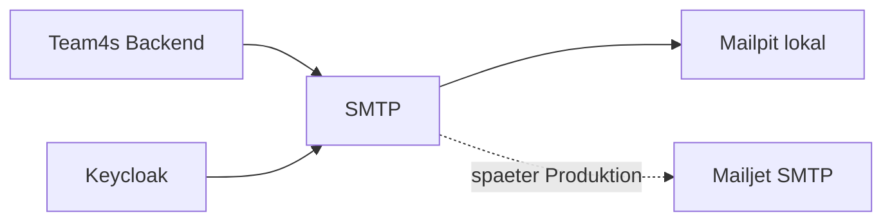

# Phase 60 Research: SMTP Mailpit lokal, Mailjet spaeter

## Befund

- `docker-compose.yml` hat DB, Redis, Keycloak, Backend und Frontend, aber keinen Mailpit-Service.
- `.env.example` dokumentiert Keycloak- und Backend-Env, aber keine SMTP-Werte.
- `backend/internal/config/config.go` kennt keine SMTP-/Mailer-Konfiguration.
- `backend/internal/handlers/app_auth.go` erstellt Fansub-Gruppeneinladungen ueber `invitationRepo.Create(...)` und gibt `invite_link` zurueck.
- `backend/internal/repository/fansub_group_invitations_repository.go` erzeugt den Roh-Token, speichert nur den Hash und baut daraus `InviteLink`.
- `infra/keycloak/realm-team4s.json` erlaubt Passwort-Reset, enthaelt aber keine SMTP-Konfiguration.

## Naechste freie Migration

Letzte gefundene Migration: `0080_member_profile_background.up.sql`. Falls Delivery-Status persistiert wird, ist `0081_*` zu verwenden. Vor Umsetzung muss `git status` und die Migration-Kette erneut geprueft werden.

## Reuse-Entscheidung

- Fuer Einladungen wird der bestehende Invitation-Flow erweitert, nicht neu gebaut.
- Fuer SMTP braucht es einen neuen Service, weil kein vorhandener Mailer existiert.
- Frontend bleibt beim bestehenden `createFansubGroupInvitation`-Helper; nur DTO/Copy/Status koennen sich aendern.

## Empfohlene Architektur

## Planungsentscheidung

Die Phase wird in drei Slices geplant:

1. Lokale SMTP-Infrastruktur und Keycloak-Mailpit-Konfiguration.
2. Backend-Mailer und Einladungsversand.
3. Contract, Frontend-UX, Docs und Mailjet-Produktionshandoff.
