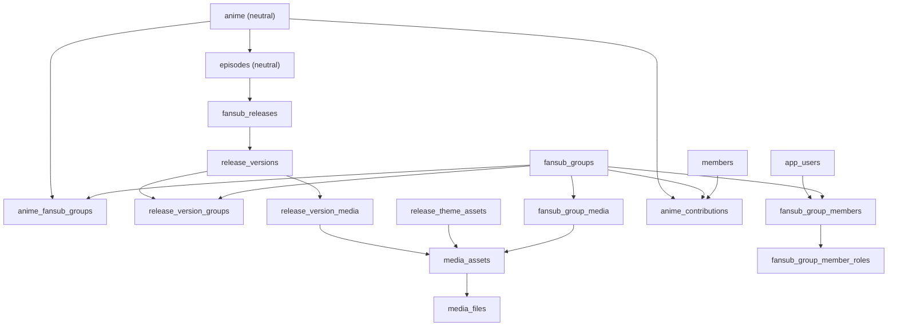

# Team4s Current System Inventory

Status: source-inspected snapshot from 2026-06-03.

Purpose: this document is the "do not rebuild what already exists" map for the current Team4s app. It connects UI routes, API routes, backend owners, database tables, media ownership, and role capabilities. Read it before planning phases that touch anime, fansubs, releases, media upload, AniSearch, Jellyfin, member profiles, contributions, or admin rights.

## Source Files

- Domain rules: `docs/architecture/db-schema-fansub-domain.md`
- Runtime authority: `docs/architecture/db-runtime-authority-map.md`
- API contract rules: `docs/api/api-contracts.md`
- Browser auth/API boundary: `docs/frontend/auth-api-client.md`
- UI inventory/components: `docs/frontend/ui-inventory.md`
- Local agent rules: `AGENTS.md`
- Primary frontend API client: `frontend/src/lib/api.ts`
- Admin routes: `backend/cmd/server/admin_routes.go`
- Public/app routes: `backend/cmd/server/main.go`

## Core Ownership Rules

- Anime is neutral. Episodes are neutral.
- Fansub context belongs to fansub groups, anime-fansub assignments, releases, release versions, and release-version groups.
- The canonical anime/fansub assignment table is `anime_fansub_groups`.
- `fansub_releases` belongs to episodes.
- `release_versions` belongs to `fansub_releases`.
- `release_version_groups.fansub_group_id` is the canonical fansub group column.
- Do not reintroduce legacy `release_version_groups.fansubgroup_id`.
- Release process media belongs to `release_versions` through `release_version_media`, `media_assets`, and `media_files`.
- `release_media` is a separate release-level/public/legacy seam. Do not use it as a replacement for release-version-scoped admin/fansub media.
- Fansub group media belongs to `fansub_group_media`, `media_assets`, `media_files`, plus `fansub_groups.logo_id` and `fansub_groups.banner_id` where applicable.
- Normal protected frontend code uses `apiClientFetch`/helpers from `frontend/src/lib/api.ts`; it must not build bearer headers, read cookies/storage directly, or call Keycloak refresh helpers directly.
- Browser protected UI should gate on an active auth session: `hasAccessToken || hasRefreshToken`.

## Current Route/API/DB Inventory

| Bereich | UI / Route | API | Backend owner | DB owner | Wer kann was | Reuse / nicht neu bauen |
| --- | --- | --- | --- | --- | --- | --- |
| Auth/session | Login-dependent app shell, profile navigation, protected admin pages | `POST /api/v1/auth/issue`, `/refresh`, `/revoke`, Keycloak backchannel logout, `GET /api/v1/me` | `backend/cmd/server/main.go`, auth handlers, `frontend/src/lib/api.ts` | `app_users`, `app_user_global_roles`, session/token tables outside this doc scope | Visitor can view public pages. Logged-in member gets `/me`. Admin/leader capability comes from roles. | Use `apiClientFetch`, `useAuthSession`, and existing auth helpers. Do not read tokens directly in UI. |
| Own profile | `/me/profile` | `GET/PUT /api/v1/me/profile`, profile media uploads, noindex toggle | `backend/internal/handlers/app_profile.go`, `app_profile_story_image.go` | `members`, `media_assets.owner_member_id`, story/background/avatar asset relations | Member edits own bio, avatar, background, story images, visibility/noindex, claims. | Reuse `ProfileBasicsForm`, `MemberAvatarCard`, `ProfileBackgroundCard`, `ProfileStoryCard`, profile API helpers. |
| Public member profile | `/members/[slug]` | `GET /api/v1/members/:slug`, contributions, badges, memberships | app/public member handlers | `members`, `member_badges`, historical contribution tables | Visitor can view public profile unless hidden/noindex rules apply. Owner can manage own badges/profile from profile area. | Reuse public member profile components and `RichTextRenderer`. |
| Public anime catalog | `/anime`, `/anime/[id]` | `GET /api/v1/anime`, `/anime/:id`, backdrops, relations, fansubs, episodes | `backend/internal/repository/anime.go`, public anime handlers | Legacy-first `anime`, `episodes`, relation/media projection tables | Visitor can browse. Logged-in users may add comments/watchlist. | Runtime is legacy-first for anime detail/list; do not switch primary reads to normalized Phase B/C tables without decision. |
| Public anime group story | `/anime/[id]/group/[groupId]` | `GET /api/v1/anime/:id/group/:groupId`, `/assets`, `/releases` | public group anime handlers | `anime_fansub_groups`, `fansub_groups`, release/group asset projections | Visitor can view group-specific anime story/assets/releases. | Reuse `GroupAssetShowcase`, `CollapsibleStory`, group release APIs. |
| Public group releases | `/anime/[id]/group/[groupId]/releases` | `GET /api/v1/anime/:id/group/:groupId/releases` with filters such as OP/ED/karaoke/search | public release handlers | `fansub_releases`, `release_versions`, `release_version_groups`, theme/segment tables | Visitor can browse release lists and filters. | Keep filter behavior in existing release endpoint/components. |
| Public fansub profile | `/fansubs/[slug]` | `GET /api/v1/fansub-slugs/:slug`, `/fansubs/:id`, aliases, members, contributions | public fansub handlers | `fansub_groups`, aliases, links, members/contributions | Visitor can view group profile, members, projects, history/contributions. | Reuse `FansubProfileTabs`, `GroupLeaderTimeline`, public contribution helpers. |
| Archive/contributions | `/archiv`, contribution sections on anime/fansub/member pages | `GET /api/v1/archiv`, public contribution routes | contribution public repositories | `anime_contributions`, `anime_contribution_roles`, `member_badges`, `hist_*` | Visitor can browse published archive. Member/leader/admin rights depend on proposal/review flows. | Reuse contribution public repositories and archive API; do not invent a second archive model. |
| Comments/watchlist | Anime detail components | `GET/POST /anime/:id/comments`, `GET/POST /watchlist`, `GET/DELETE /watchlist/:anime_id` | public app handlers | comments/watchlist tables | Logged-in member can comment and manage watchlist. Visitor can read allowed public data. | Use existing watchlist/comment components and API helpers. |
| Streaming/playback | Public anime/episode/release playback links | episode/release grant and stream endpoints, `/assets/:assetId/stream`, media image/video/file endpoints | playback/media handlers | releases, streams, `media_assets`, `media_files`, legacy release media | Logged-in/authorized users get grants; public media endpoints serve controlled assets. | Do not bypass existing grant/stream endpoints for release media. |
| Admin anime list/detail/create/edit | `/admin/anime`, `/admin/anime/create`, `/admin/anime/[id]/edit` | Admin anime CRUD, relation endpoints, asset endpoints, tag tokens | admin content anime handlers and repositories | Runtime admin anime writes are legacy-first flat `anime` columns plus asset slot tables | Global admin creates/edits anime metadata, relations, assets, and import/enrichment data. | Reuse `SharedAnimeEditorWorkspace`, create controller, `AnimeEditWorkspace`, `AnimeEditAssetSection`, `admin-anime-intake.ts`. |
| Admin Episodenverwaltung | `/admin/anime/[id]/episodes`, `/admin/anime/[id]/episodes/[episodeId]/edit`, `/admin/anime/[id]/episodes/[episodeId]/versions`, `/admin/episodes` | `POST/PATCH/DELETE /admin/episodes`, Episode-Version-CRUD `/anime/:id/episodes/:episodeNumber/versions`, `PATCH/DELETE /episode-versions/:versionId` | admin episode/version handlers, episode repositories | `episodes` (neutral), `episode_titles`, `episode_version_episodes`, `episode_theme_overrides` | Global admin verwaltet Episoden und Episodenversionen je Anime und global. | Reuse bestehende Episode-/Version-Admin-Pages und API-Helfer (`createAdminEpisode`, `updateAdminEpisode`, `createEpisodeVersion`, …); keine zweite Episodenliste bauen. |
| Admin Episoden-Import | `/admin/anime/[id]/episodes/import` | `GET /admin/anime/:id/episode-import/context`, `POST …/episode-import/preview`, `POST …/episode-import/apply`, `GET /admin/episode-versions/:versionId/editor-context`, `POST …/folder-scan` | episode-import/intake handlers, Jellyfin services | `episodes`, `episode_titles`, `release_versions`, `release_variants`, `stream_sources` | Global admin mappt/importiert Episoden (preview-only bis explizites Apply). | Reuse Episode-Import-Workbench, `getEpisodeImportContext`, `previewEpisodeImport`, `applyEpisodeImport`, `scanEpisodeVersionFolder`. |
| AniSearch enrichment | Admin anime create/edit enrichment controls | `/admin/anime/enrichment/anisearch`, search, per-anime enrichment routes | `anisearch_client.go`, `anime_create_enrichment.go`, admin handlers | Anime metadata fields, enrichment/backfill targets where documented | Global admin can search/import/apply AniSearch metadata. | Reuse existing create/edit enrichment controllers; do not add a parallel AniSearch parser/client. |
| Jellyfin intake/sync | Admin anime create/edit Jellyfin sections | Jellyfin context, preview, apply, sync, episode import/intake routes | Jellyfin admin handlers/services | Anime fields, episode fields, asset slots, Jellyfin provider keys | Global admin can preview/apply/sync Jellyfin metadata, series, episodes, and assets. | Reuse `useJellyfinIntake`, Jellyfin context/preview/apply API helpers. |
| Anime media/assets | Admin anime create/edit asset sections | `POST /admin/anime/:id/assets/*`, `POST /admin/upload`, asset search/assign/delete | `admin_content_anime_assets.go`, `media_upload.go`, `anime_assets.go` | `media_assets`, `media_files`, anime slot columns, `anime_background_assets`, legacy `anime_media` | Global admin can upload/link cover, banner, logo, backgrounds, background video. | Reuse `uploadAdminAnimeMedia`, asset assign/delete helpers, `AnimeEditAssetSection`. |
| Fansub admin workspace | `/admin/fansubs/[id]/edit` | Fansub CRUD, links, aliases, members, app members, notes, history, releases, contributions, claims | admin fansub/content handlers | `fansub_groups`, links/aliases, app membership, notes, historical and contribution tables | Global admin has broad management. Fansub leader reaches the same canonical route for owned groups where capability permits. | This is the canonical internal leader/admin workspace. Do not continue review/admin behavior in `/admin/my-groups/[id]` unless a decision changes ownership. |
| Fansub basic data | `/admin/fansubs/[id]/edit` tab `Grunddaten` | `POST/PATCH/DELETE /admin/fansubs`, links, aliases | admin fansub handlers/repositories | `fansub_groups`, `fansub_group_links`, alias tables | Admin/authorized leader edits group identity, links, aliases, description fields. | Reuse existing page tabs and API helpers. |
| Fansub group media | `/admin/fansubs/[id]/edit` tab `Medien` | `POST /admin/fansubs/:id/media`, `DELETE /admin/fansubs/:id/media/:kind` | `fansub_media_upload.go`, media repository/service | `fansub_group_media`, `media_assets`, `media_files`, `fansub_groups.logo_id/banner_id` | Admin/authorized leader uploads or deletes logo/banner/group media. | Reuse `frontend/src/components/admin/MediaUpload.tsx`, `uploadFansubMedia`, `deleteFansubMedia`. |
| App members/invitations | Fansub admin app-member section | app member candidates, app members, invitations, role/status routes | admin app member handlers | `app_users`, `fansub_group_members`, `fansub_group_member_roles`, `fansub_group_invitations` | Admin/authorized leader invites users, changes status, assigns fansub roles, lead role where permitted. Member accepts invitations. | Reuse `FansubAppMembersSection` and invitation/member API helpers. |
| Historical group members/roles | Fansub admin historical tabs and public timelines | history, group members, member roles, role definitions routes | historical contribution handlers/repositories | `hist_fansub_group_members`, `hist_group_member_roles`, `fansub_group_history`, `role_definitions` | Admin/leader manages historical members/roles. Public pages show curated history/timelines. | Reuse `GroupMembersTab`, `MemberRolesTab`, `GroupLeaderTimeline`. |
| Claims/member requests | Profile claim area and admin fansub claims tab | `/me/member-claim`, `/me/member-claims`, claim invitations, admin member claim/request routes | member claim/request handlers | `member_claims`, `member_claim_invitations`, request tables | Member requests/accepts claims. Admin/leader reviews claim context where permitted. | Reuse `MemberClaimSection`, `ClaimManagementPanel`, claim invitation APIs. |
| Anime/fansub assignment | Fansub admin anime/release tab | attach/detach anime fansub, `/admin/fansubs/:id/anime` | admin fansub anime handlers | `anime_fansub_groups` | Admin/authorized leader links anime projects to group and manages group-specific release context. | Cache release data by `animeFansubGroupId` or `fansubGroupId:animeId`; avoid global per-anime state. |
| Admin fansub releases | Fansub admin tab `Anime & Veroeffentlichungen`, release drawer | `/admin/fansubs/:id/anime/:animeId/releases`, `/canonical`, `GET /admin/releases/:releaseId` | `admin_content_fansub_releases.go`, release handlers | `fansub_releases`, `release_versions`, `release_version_groups`, episodes | Admin/authorized leader views and edits group release versions/details. | Reuse release drawer, canonical release lookup, `getAdminRelease`, `getAdminFansubAnimeReleases`. |
| Release detail drawer | Side drawer inside `/admin/fansubs/[id]/edit` | release detail, update/delete release version, merge, member roles, notes | admin release/version handlers | `fansub_releases`, `release_versions`, `release_version_groups`, `release_member_roles`, `release_version_notes` | Admin/leader edits release/version metadata and release member roles if capability allows. | Keep release detail editing in drawer/side panel. Do not build separate hidden leader admin route. |
| Release theme assets | Release drawer/media areas and `ReleaseThemeAssetsSection` | release/fansub anime theme asset list, upload, delete | `admin_content_release_theme_assets.go`, theme repository | `release_theme_assets`, `themes`, `theme_segments`, `media_assets`, `media_files` | Admin/authorized leader uploads release OP/ED/theme videos and deletes them where permitted. | Reuse `uploadAdminReleaseThemeAsset`, `uploadAdminReleaseThemeAssetForRelease`, `deleteAdminReleaseThemeAsset`. |
| OP/ED themes and segments | Admin anime/fansub release theme sections | `/admin/theme-types`, anime themes, segments, segment suggestions/reuse/asset | `admin_content_anime_themes.go` | `theme_types`, `themes`, `theme_segments`, `episode_theme_overrides`, segment library/playback tables | Global admin manages theme/segment taxonomy. Authorized release users can attach related assets where allowed. | Reuse existing theme/segment APIs, `FansubOpEdSection`, segment asset upload helpers. |
| Release-version process media | `/admin/episode-versions/[versionId]/edit`, release drawer summary | `/admin/release-versions/:versionId/media`, capabilities, reorder, patch, delete | `admin_content_release_version_media.go`, `release_version_media_repository.go` | `release_version_media`, `media_assets`, `media_files` | Capability-gated: view/upload/update/delete release-version media. | Reuse `ReleaseVersionMediaSection.tsx`, `useReleaseVersionMedia.ts`, `uploadReleaseVersionMedia`. Never attach this media directly to episodes. |
| Notes/stories/project notes | Fansub admin tabs and anime project note sections | fansub notes, member stories, anime project notes, release version notes | note/story handlers, `tiptap_service.go` | `fansub_group_notes`, `member_group_stories`, `anime_fansub_project_notes`, `release_version_notes` | Admin/leader creates/edits notes/stories where permitted. Public profile pages render sanitized stories. | Reuse TipTap validation/rendering service and existing note tabs. |
| Anime contributions/proposals | Profile, archive, fansub admin contribution tabs, review queues | `/me/contribution-proposals`, self-publish, confirm/reject, admin contribution routes | contribution repositories/handlers | `anime_contributions`, `anime_contribution_roles`, `member_badges`, release-version link columns | Member can propose/self-publish allowed contributions. Fansub leader reviews group proposals. Global admin can broadly manage. | Phase-65 review UX belongs in `/admin/fansubs/[id]/edit` under `Offene Vorschlaege`; do not rebuild in `/admin/my-groups/[id]`. |
| Collaboration members | Fansub public/admin collaboration controls where surfaced | `GET/POST/DELETE /fansubs/:id/collaboration-members` | collaboration handlers | collaboration membership tables | Authorized users manage collaboration members. Visitors see public-safe data only. | Reuse existing collaboration endpoints and authz checks. |
| Badges | Member profile and archive | `/me/badges`, badge visibility patch | `badge_service.go`, app handlers | `member_badges`, contribution-derived badge data | Member manages own badge visibility. Public sees visible badges. | Reuse badge service; do not compute badge state ad hoc in UI. |

## Zusätzliche UI-Routen (Einstieg, Auth-Flows, Listen)

Diese Pages existieren unter `frontend/src/app/`, fehlten aber in der Haupttabelle. Vor neuen Seiten hier prüfen.

| UI-Route | Zweck | Wer kann was | Reuse / nicht neu bauen |
| --- | --- | --- | --- |
| `/` | App-Startseite/Landing | Visitor | Bestehende Home-Page erweitern, nicht ersetzen. |
| `/login` | Login-Einstieg (Keycloak-Flow) | Visitor | Über zentrale Auth-Seam (`useAuthSession`, `apiClientFetch`); keine Token direkt lesen. |
| `/episodes/[id]` | Öffentliche Episodendetailseite | Visitor; autorisierte User erhalten Playback-Grants | Bestehende Episode-Detail-Komponenten/Playback-Seams wiederverwenden. |
| `/watchlist` | Eigene Watchlist (dedizierte Seite) | Logged-in member | `getWatchlist`/Watchlist-Helfer wiederverwenden; nicht doppeln. |
| `/me/contributions` | Eigene Beiträge (dedizierte Seite) | Logged-in member | `getMyAnimeContributions`/Contribution-Helfer wiederverwenden. |
| `/invitations/accept` | Fansub-Einladung annehmen | Eingeladener User | `acceptFansubInvitation` wiederverwenden. |
| `/claim-invitations/accept` | Member-Claim-Einladung annehmen | Eingeladener User | `acceptClaimInvitation` wiederverwenden. |
| `/manage/groups` | Gruppen-Verwaltungs-Einstieg (Leader/Mitglied) | Fansub leader/member je Capability | Kanonischer Leader-Workspace bleibt `/admin/fansubs/[id]/edit`; hier kein paralleles Review/Admin aufbauen. |
| `/admin` | Admin-Dashboard | Global admin | Bestehendes Dashboard erweitern. |
| `/admin/profile` | Admin-Profil (Übergang auf `/me/profile`) | Global admin | Ist ein Transition-Wrapper um `/me/profile` — keine zweite Eigenprofil-Implementierung. |
| `/admin/fansubs` | Fansub-Liste (Admin) | Global admin | Bestehende Listen-Page wiederverwenden. |
| `/admin/fansubs/create` | Fansub anlegen | Global admin | `createFansubGroup` wiederverwenden. |
| `/admin/fansubs/merge` | Fansub-Merge-Workflow | Global admin | `mergeFansubsPreview`/`mergeFansubs` wiederverwenden; siehe Merge-Endpunkte unten. |
| `/admin/my-groups` | Eigene-Gruppen-Liste | Fansub leader/member | Kanonische Leader-Arbeit über `/admin/fansubs/[id]/edit`; siehe Duplication-Trap. |
| `/dev/ui-system` | Design-System-Showcase (Pflicht-Referenz für `@/components/ui`) | Intern/Dev | Showcase der globalen Primitives; keine neuen Primitive-Forks. |

## Next.js BFF / Route-Handler

Die geschützte Auth-/Media-Naht läuft teils über Next.js Route-Handler (`frontend/src/app/**/route.ts`). Diese Naht ist Teil der Kern-Ownership-Regeln (siehe `docs/frontend/auth-api-client.md`) und darf nicht umgangen werden.

| Handler-Route | Zweck | Reuse / nicht neu bauen |
| --- | --- | --- |
| `/api/v1/[...path]` | Catch-all-Proxy auf das Go-Backend | Einziger Browser→Backend-Proxy; nicht per ad-hoc `fetch` umgehen. |
| `/api/auth/keycloak/token` | Keycloak-Token-Austausch (serverseitig) | Über zentrale Auth-Seam; keine Token im Client bauen. |
| `/api/auth/keycloak/logout` | Keycloak-Logout/Backchannel | `logoutActiveAuthSession`-Pfad wiederverwenden. |
| `/api/admin/upload-cover` | Cover-Upload-Transport | Bestehenden Upload-Transport (`authorizedUploadXhr`) wiederverwenden. |
| `/api/admin/asset-proxy` | Asset-Proxy für Admin-Vorschauen | Bestehenden Proxy wiederverwenden, kein zweiter Transport. |
| `/covers/[file]` | Cover-Datei-Serving | Bestehenden Serving-Pfad wiederverwenden. |
| `/media/[...path]` | Media-Datei-Serving (catch-all) | Bestehenden Serving-Pfad wiederverwenden; nicht parallel implementieren. |

## Ergänzende Backend-Endpunkte (Code-Abgleich 2026-06-03)

| Endpunkt | Bereich | Reuse / nicht neu bauen |
| --- | --- | --- |
| `GET /api/v1/genres` | Öffentliche Genre-Token | Bestehenden öffentlichen Genres-Endpoint wiederverwenden. |
| `GET /api/v1/admin/genres`, `GET /api/v1/admin/tags` | Admin-Genre-/Tag-Token | `getAdminGenreTokens`/`getAdminTagTokens` wiederverwenden. |
| `POST /api/v1/admin/fansubs/merge`, `…/merge/preview` | Fansub-Merge | `mergeFansubs`/`mergeFansubsPreview`; UI unter `/admin/fansubs/merge`. |
| `GET /api/v1/admin/member-requests`, `…/:requestId/approve`, `…/:requestId/reject` | Member-Requests-Review (getrennt von Member-Claims) | `listMemberRequests`/`approveMemberRequest`/`rejectMemberRequest` wiederverwenden; nicht mit Claim-Review vermischen. |

## Media Ownership Matrix

| Media seam | Existing UI/API | Backend/service | Canonical DB | Owner meaning | Do not confuse with |
| --- | --- | --- | --- | --- | --- |
| Fansub branding/group media | `MediaUpload.tsx`, `/admin/fansubs/:id/media` | `fansub_media_upload.go`, `MediaService.SaveUpload` | `fansub_group_media`, `fansub_groups.logo_id/banner_id`, `media_assets`, `media_files` | Media belongs to a fansub group. | Anime assets or release-version process media. |
| Anime cover/banner/logo/background/video | Anime create/edit asset UI and admin asset APIs | `admin_content_anime_assets.go`, `AnimeAssetRepository`, generic upload | Anime slot columns, `anime_background_assets`, `media_assets`, `media_files` | Media belongs to the neutral anime record. | Fansub-specific project branding. |
| Release theme asset | Release drawer/theme sections | `admin_content_release_theme_assets.go`, theme repository | `release_theme_assets`, `themes`, `theme_segments`, `media_assets`, `media_files` | Media belongs to release/theme context such as OP/ED/theme video. | Release-version process screenshots/files. |
| Release-version process media | `/admin/episode-versions/[versionId]/edit`, drawer summary | `admin_content_release_version_media.go`, `ReleaseVersionMediaRepository` | `release_version_media`, `media_assets`, `media_files` | Media belongs to one concrete release version. | `episode_media`, `release_media`, or direct episode attachment. |
| Segment asset | Theme segment UI/API | theme/segment handlers | segment library/playback tables, media asset/file tables | Media belongs to reusable or release-linked OP/ED segment logic. | General release uploads. |
| Member avatar/background/story images | `/me/profile` | `app_profile.go`, `app_profile_story_image.go` | `members`, `media_assets.owner_member_id`, media files | Media belongs to a member profile/story. | Fansub group member records or historical member data. |
| Generic admin upload | `POST /admin/upload` through API helper | `media_upload.go`, `AssetLifecycleService` | `media_assets`, `media_files`, limited join support | Transport/asset lifecycle helper for allowed entity types. | A permission/ownership shortcut. It currently only accepts normalized allowed entity types. |
| Legacy/public release media | public release assets/images | public media/release handlers | `release_media`, `media_assets`, `media_files` | Public/legacy release-level assets. | Admin/fansub release-version-scoped process media. |

## Role Capability Summary

| Rolle | Can | Cannot / should not |
| --- | --- | --- |
| Public visitor | Browse public anime, fansub profiles, member profiles, archive, public releases, media that is intentionally public. | Cannot mutate profile, watchlist, comments, admin, release, contribution review, or upload data. |
| Logged-in member | Manage own profile, avatar/background/story images, own noindex/badge visibility, watchlist/comments, own claims, invitations, allowed contribution proposals/self-publish flows. | Cannot manage other users, global anime data, fansub admin data, release media, or review queues without role/capability. |
| Fansub member | Has group context. Depending on assigned role/capability can view or contribute to group-owned admin surfaces. | Capability must be checked per group/release/release-version context; membership alone should not bypass authz. |
| Fansub leader | Uses canonical internal workspace `/admin/fansubs/[id]/edit` for owned group work. Can manage permitted group data such as media, app members, projects, releases, notes, proposals/reviews, roles, depending on server capability checks. | Should not use `/admin/my-groups/[id]` for leader review/admin behavior. Must not write media into wrong owner table. |
| Global admin | Broad admin rights: anime create/edit, AniSearch/Jellyfin, fansub CRUD, users/app members, releases, claims, archive/contribution administration, theme/segment management. | Still must respect domain ownership and contract files. Global admin power is not a reason to bypass canonical seams. |

## Database Relationship Map

Important DB groups:

- Base anime: `anime`, `episodes`, relation tables, watchlist/comments.
- Fansub assignment and releases: `anime_fansub_groups`, `fansub_releases`, `release_versions`, `release_version_groups`.
- Media core: `media_assets`, `media_files`.
- Anime media: anime slot columns (`cover_asset_id`, `banner_asset_id`, logo/background video columns), `anime_background_assets`, legacy `anime_media`.
- Fansub group media: `fansub_group_media`, `fansub_groups.logo_id`, `fansub_groups.banner_id`.
- Release process media: `release_version_media`.
- Release theme/public assets: `release_theme_assets`, `themes`, `theme_segments`, segment library/playback tables, legacy/public `release_media`.
- App users and group permissions: `app_users`, `app_user_global_roles`, `fansub_group_members`, `fansub_group_member_roles`, `fansub_group_invitations`.
- Notes/stories: `fansub_group_notes`, `member_group_stories`, `anime_fansub_project_notes`, `release_version_notes`, plus member-scoped `member_anime_notes`, `member_episode_notes`.
- Historical/archive/contribution data: `members`, `hist_fansub_group_members`, `hist_group_member_roles`, `fansub_group_history`, `role_definitions`, `anime_contributions`, `anime_contribution_roles`, `member_badges`, `member_claims`, `member_claim_invitations`.
- Episode detail/coverage: `episodes`, `episode_titles`, `episode_version_episodes`, `episode_theme_overrides`.
- Anime metadata side tables: `anime_titles`, `anime_source_links` (provider keys wie `anisearch:<id>`, `jellyfin:<id>`), `media_external`.
- Genres/tags: `genres` + `anime_genres`, `tags` + `anime_tags`.
- Streaming/release-variant graph: `release_streams` (kanonisch, release-gebunden), `release_sources`, `release_variants`, `release_variant_episodes`, `stream_sources`, `stream_types`. Legacy `streams` bleibt nur erlaubte Kompatibilitätsabweichung — neue Arbeit zielt auf `release_streams`.
- Audit: `admin_anime_mutation_audit`, `audit_logs` — tragen die in CLAUDE.md geforderte Audit-Attribution; nicht selbst nachbauen.
- Legacy-Parallelwelt (NICHT als kanonisch behandeln): `backend/database/migrations/` erzeugt zweite media-Tabellen (`media_assets`, `media_files`, `anime_media`, `episode_media`, `fansub_group_media`, `release_media`) mit abweichendem Schema neben `database/migrations/`; Legacy `users`/`roles`/`user_roles` existieren neben `app_users`/`app_user_global_roles`. Kanonisch sind die `app_*`-Tabellen und die `database/migrations/`-Media-Tabellen.

## API Contract Checklist

Before changing or adding endpoint behavior:

1. Inspect `shared/contracts/openapi.yaml`.
2. Inspect `shared/contracts/admin-content.yaml` if the route is admin-content scoped.
3. Inspect backend route registration in `backend/cmd/server/main.go` or `backend/cmd/server/admin_routes.go`.
4. Inspect DTOs/handlers/repositories for the existing shape.
5. Inspect `frontend/src/lib/api.ts`, `frontend/src/lib/api/admin-anime-intake.ts`, and frontend types.
6. Update contract, backend, frontend helper/types, and focused tests together where feasible.

## Pre-Build Checklist For New Work

- Which domain owns the data: neutral anime/episode, fansub group, anime-fansub assignment, release, release version, member, or contribution?
- Is there already a route in `/admin/fansubs/[id]/edit`, `/admin/anime`, `/me/profile`, public anime/fansub/member pages, or release drawer?
- Is there already an API helper in `frontend/src/lib/api.ts` or `frontend/src/lib/api/admin-anime-intake.ts`?
- Is there already an upload UI/hook: `MediaUpload.tsx`, `ReleaseVersionMediaSection.tsx`, `useReleaseVersionMedia.ts`, anime asset controls, Jellyfin asset controls, or profile media controls?
- Which table is canonical for the media owner?
- Does the protected UI gate on `hasAccessToken || hasRefreshToken` and call the central API client?
- Does this touch public visitor, member, fansub leader, or global admin rights?
- Does the change require OpenAPI/admin-content contract updates?
- Is the runtime authority legacy-first, adapter-backed, normalized-first, or blocked by `db-runtime-authority-map.md`?

## Known High-Risk Duplication Traps

- Building a second fansub leader workspace instead of extending `/admin/fansubs/[id]/edit`.
- Adding release admin/review behavior to `/admin/my-groups/[id]`.
- Uploading release-version process media through `release_media`, `episode_media`, or direct episode attachment.
- Treating `fansub_group_media` as a release media table.
- Adding a new upload transport instead of using `authorizedUploadXhr` and the existing upload helpers.
- Creating another AniSearch/Jellyfin client instead of reusing the existing services and admin intake/edit controllers.
- Reading tokens/cookies directly in UI instead of using the central auth/API seam.
- Switching public anime reads to normalized tables without a runtime authority decision.
- Letting UI infer undocumented response fields or fallback behavior from ad hoc `fetch`.
- Building a second episode-management surface instead of reusing `/admin/anime/[id]/episodes`, `/admin/episodes`, and the episode-import workbench.
- Bypassing the Next.js BFF (`/api/v1/[...path]` proxy, keycloak token/logout handlers) with direct browser→backend `fetch`.
- Treating the legacy `streams` table or the parallel `backend/database/migrations/` media tables as canonical instead of `release_streams` and the `database/migrations/` media tables.
- Mixing member-request review (`/admin/member-requests`) with member-claim review — they are separate flows.
