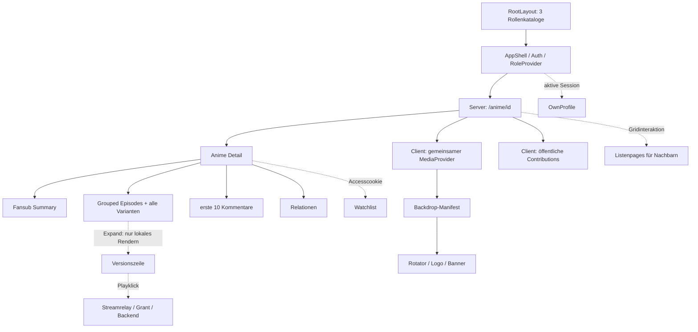

# GSD / QCS Deep Audit – öffentliche Anime-Detailseite

**Audit abgeschlossen; keine Implementierung freigegeben oder ausgeführt.**

Stand: **13.09.2026**, kanonisches Repository `/home/d1sk/team4s` auf `team4s-linux`, Commit **`7c7e1c7d02ac870e7c68c02b66fd7f4b33f36b85`**. Einstieg im gemeinsamen Browser: [Buddy Complex](http://127.0.0.1:3300/anime/1). Analyse durch GPT Astra mit getrennten Komponenten- und Backend-Mappings sowie eigener Live-Verifikation.

## Ergebnis

Die Seite enthält nachweisbare Altlasten und Funktionsfehler, aber keinen belegten Anlass für einen vollständigen Rewrite. Die dringlichsten Probleme sind **unsichtbare Episodentitel**, **Refresh-only-Sessions, die an lokalen UI-Gates hängen bleiben**, **horizontaler Hero-Überlauf**, **erfundene Kennzahlen** und **permissive ID-/Fehlerseitenbehandlung**.

Performance wird heute vor allem durch Medien belastet: das mobil 160px breite Cover überträgt rund 740 KB. Die sieben Anime-Datenantworten umfassen beim aktuellen kleinen Datensatz zusammen nur 15.090 JSONbytes. Das vorhandene Read-Model hat dennoch konkrete unnötige Abfragen und unlimitierte Listen. Aussagen über Produktionslatenz, Speicherabstürze oder N+1-Probleme werden daraus nicht pauschal abgeleitet.

**Nicht bestätigt:** kaputter numerischer Gruppenlink, falsche aktuelle Streamzuordnung, JSON-Polling alle 200ms, API-Nachladen pro Episode oder drei separate Manifestrequests für Logo/Banner/Rotator. Diese Gegenbefunde begrenzen den Folgeplan.

## Dokumente und Beweisarten

| Dokument | Inhalt |
|---|---|
| [COMPONENTS-AND-CLIENT.md](COMPONENTS-AND-CLIENT.md) | Vollständiger Renderbaum, Server-/Clientgrenzen, Props, State, Effects, Storage, Timer, Navigation, Medien, CSS, Quellstellen C-01 bis C-12 |
| [REQUESTS-AND-SQL.md](REQUESTS-AND-SQL.md) | Alle Requestklassen einschließlich Root-Layout/AppShell/Auth/Medien/Play; Helpers, Handler, Repositories, SQL, Payload, Cache, bedingte Budgets und Read-only-SQLproben |
| [RUNTIME-VERIFICATION.md](RUNTIME-VERIFICATION.md) | Live-Navigation, Netzwerk-/Payloadmessung, Routeproben, CSS-Geometrie, Screenshots, Testresultate und Messgrenzen |
| [FOLLOW-UP-PLAN.md](FOLLOW-UP-PLAN.md) | Priorisierte, begrenzte Folgeslices mit bestehenden Analogdateien, Abhängigkeiten und prüfbaren Abnahmekriterien; **nicht ausgeführt** |
| [evidence/](evidence/) | Maschinenlesbare Messungen, Prüfprotokolle und eine reproduzierbare reine Layoutprobe |

**L** = selbst beobachtete Laufzeit, **S** = eindeutiger Codepfad, **D** = lesende Datenbankprobe. Ein S-Befund kann eine bewiesene fehlerhafte Bedingung beschreiben, ohne dass die aktuelle kleine VM einen passenden Live-Datensatz besitzt. Solche Fälle sind ausdrücklich gekennzeichnet. P1 = zeitnaher Funktionsfix; P2 = konkrete reguläre Korrektur; P3 = begrenzte nachfolgende Konsolidierung oder noch zu klärende Produktabdeckung. Kein P0/Sicherheitsvorfall belegt.

## 1. Heutiger GSD-/Architekturmaßstab

Gelesen wurden AGENTS/AI-HANDOFF, ROADMAP/STATE/PROJECT, Milestoneaudit sowie relevante CONTEXT-/SUMMARY-/VERIFICATION-Abschnitte der Phasen 147–157. Die genaue Quellenmatrix mit Pfaden und fehlenden Artefakten steht in Abschnitt1 des Komponentenberichts.

| Heutige Entscheidung | Konsequenz für Anime |
|---|---|
| 147/148: stabile Rollen-Codes, Katalogfarben über gemeinsame Naht | Keine lokalen Parallelkataloge oder Label→Rolle-Heuristiken hinzufügen. Neutrale Chips sind nicht allein wegen fehlender Rollenfarbe falsch. |
| 149: gültige globale Tokens und lesbarer Kontrast | Lokales dunkles Page-Theme darf nicht unkontrolliert mit hellen Shared-Komponentenfarben kollidieren. Genau diese Kollision ist live vorhanden. |
| 150/151: fachliche Schwellenautorität, gemeinsame Artwork-/Carousel-Primitives | Anime enthält keine Badge-Schwellenberechnung. Ein Anime-Relationsslider ist nicht automatisch ein Badge-Carousel und soll nicht blind ersetzt werden. |
| 152: Publicprofile und Domainprojektionen bewusst getrennt; Bedarf/Queries/Bilder begrenzen | Mehrere Endpoints sind nicht automatisch Duplikate. Schlanke Gruppensummaries für Storydaten existieren und werden korrekt genutzt. |
| 153/154: nichtblockierendes SSR, renderer-only Publiccode, begrenzte Bilder und gezielte Viewerauflösung | Bestehenden gemeinsamen Manifestprovider erhalten; keine Editor-/Vollprofilimporte allein zur Darstellung. Authentifizierte Shell lädt aktuell noch den reichen Ownerprofile-DTO. |
| 155: schlanker Pretty-Projektresolver statt Vollprofil zur ID-/Slugauflösung | Anime-CTA nutzt weiterhin den numerischen Compatibility-Einstieg. Numerische Route existiert absichtlich; der **primäre Link** ist die Modernisierungslücke. |
| 156: `theme_segment_assignments` und Contributor-Subset sind Segmentwahrheit | Ungenutzte Range-/Versionslabel-Segmentprojektion im grouped Endpoint ist eine echte Altlast. Aktuelle 13 Counts stimmen trotzdem; kein falsches sichtbares Segment behaupten. |
| 157, zuletzt 157-10: kompakter Projekt-Member, Release-Historie dort entfernt | Keine automatische Übertragung der Member-Informationsarchitektur auf die neutrale Anime-Seite. Phase 157 hat noch keinen vollständigen menschlichen Sign-off. |

**Quellenstatus:** STATE ist `executing`, gestoppt nach 157-10, Human-Live-UAT offen. Der ältere v1.4-Milestoneaudit vom 01.09.2026 deckt nur 136–144 ab und ist keine Freigabe für 150+. `156-VERIFICATION.md` fehlt; 156-15 hält einen Live-UAT-Punkt offen. Ältere PROJECT-/Roadmap-Milestonetexte sind nicht gleich aktuell wie die jüngsten Phasenartefakte. Diese Dokumente wurden im Audit nicht umgeschrieben oder als erledigt markiert.

Anime und Episoden bleiben neutral. Releaseversionen, Gruppen, Segmente und Prozessmedien behalten ihre jeweiligen fachlichen Besitzer. Keine Tabelle, Migration, Release-Historie oder numerische Route erhält durch diesen Bericht eine Löschfreigabe.

## 2. Architektur- und Requestübersicht

**Frischer anonymer Dokumentaufruf ohne Access-/Fallbacktoken, ungecachte erfolgreiche v2-Pfade:**

- SSR: 3 globale Katalogrequests/3 SELECTs plus Anime/Fansubs/Episoden/Kommentare/Relationen mit 5 Requests/24 SELECTs.
- Clientinitial: Backdrops und Contributions mit 2 Requests/11 SELECTs.
- **Summe: 10 fachliche API-Aufrufe, 38 SQL-Statements statisch.** Davon Animekern 7/35. Medien, Framework, Auth und externe Providerprobes sind getrennt. Das ist keine gemessene Anzahl jedes warmen SPA-Aufrufs.
- Watchlist nur bei serverseitigem Access; OwnProfile nur bei aktiver Browser-Session; Refresh, `/me`, Replay und Netzretry konditional. Abschnitt12 des Backendberichts enthält die zusätzliche Owner-/Sessionarbeit einschließlich Redis und Authmiddleware-Schreibeffekten.
- Lazy: Edge-Nachbarn auf Interaktion, gegebenenfalls 1–3 Listenpages; Play erst auf Klick. Episoden-/Versionsbeitrags-Disclosure ist nur spätes DOM-Rendering, keine Lazy-Datenabfrage.
- Wiederkehrend: lokale Storageprüfung alle 200ms, visueller Backdropwechsel alle 9s; kein Daten-API-Poll im beobachteten 31-Sekunden-Fenster.

## 3. Konsolidierte Findings

### F-01 · P1 · L+S: Episodentitel sind visuell unsichtbar

`page.module.css:13` vererbt Weiß. `FansubVersionBrowser.module.css:103` setzt weiße Karten; Header erbt die Textfarbe, summaryLine überschreibt sie nicht. Mobile und Desktop: Text **rgb(255,255,255)** auf Karten **rgb(255,255,255)**. Contributionheading nimmt dagegen den dunklen globalen Texttoken auf dunklem Pagebackground. Daten/AX enthalten die Titel; das Problem ist die CSS-Komposition. Siehe C-11 und `evidence/layout.json`.

### F-02 · P1 · S, Auth-Livefall offen: gültige Refreshsession erreicht Aktionen nicht

`CommentForm.tsx:29,38,111`, `WatchlistAddButton.tsx:31,38,96` verwenden `hasRuntimeAuthToken` (`api.ts:1139`, nur Access) und lokale Mountsnapshots. Der zentrale Client könnte erneuern; vorgeschaltete disabled-Gates verhindern es. Shell verwendet korrekt Access **oder** Refresh. Sichtbarkeit ist wegen paralleler Sessionerneuerung timingabhängig. Das ist ein Funktions-/Sessionfehler, kein bewiesener unautorisierter Zugriff. Siehe C-01 und Backend§5/12.

### F-03 · P2 · L+S: Hero erzeugt echten horizontalen Überlauf

`page.module.css:54,61,62,67`: sichtbarer Overflow, negative Insetwerte und scale1.1. Bei Viewport390 entsteht Dokumentbreite454, bei1440 Breite1555; gemessener scrollX lässt sich tatsächlich verändern. Ursache ist mit BoundingRects bestätigt, nicht bloß am Screenshot vermutet. Siehe C-12.

### F-04 · P2 · L+S: Kennzahlen und externe Zuordnung sind nicht datenbasiert

`page.tsx:171` zeigt fest **7.8**; v2-Mapper `backend/internal/repository/anime_v2.go:245` liefert ViewCount=0, das UI rendert dies als Views. `frontend/src/lib/emby.ts:2,5,11` enthält feste Basis-/Serverwerte und nur Anime22→Emby2112. Rating/0Views sind aktuell sichtbar; die Testzuordnung ist sourcebelegt, ein falsches externes Liveziel nicht nachgewiesen. Keine neue Bewertungs- oder Mediawahrheit erfinden. Siehe C-03/A-VIEW-01.

### F-05 · P2 · L+S: ID-Prüfung und Fehlermetadaten erzeugen falsche öffentliche URLs

`page.tsx:57,59,83`: parseInt akzeptiert Zahlenpräfixe; normale Fehler-Returns statt notFound. `/anime/1abc` liefert200 und Buddy Complex; `/anime/999999999` liefert200 mit „Anime nicht gefunden“. Kein Canonical, kein seiteneigenes Metadata, Titel allgemein „Team4s v3.0“. Die aktuelle numerische Anime-Route bleibt gültig; eine Anime-Slugroute ist nicht vorhanden und nicht ohne Produktentscheidung einzuführen. Siehe C-10 und Routeproben.

### F-06 · P2 · L+S: primärer Projekteinstieg nutzt den breiten Compatibilitypfad

`FansubVersionBrowser.tsx:179` verlinkt `/anime/:id/group/:groupId`. Diese Route funktioniert und setzt den korrekten Pretty-Canonical; sie leitet nicht um. Der Loader ermittelt Navigation weiter über Groupdetail/Vollprofil, während die Pretty-Route den Phase155-Resolver verwendet. Zweifache Callerstellen sind wegen möglicher Requestmemoization **kein Beweis zweier realer HTTPdownloads**. Der unnötig breite Abhängigkeitspfad ist dennoch belegt. Siehe A-NAV-01 und Live-Navigation.

### F-07 · P2 · S: Relations lädt den ganzen Anime erneut; weitere Metadaten bleiben ungenutzt

`handlers/anime.go:221` lädt für die Existenzprüfung `GetByID` erneut: sieben SQLs für Anime/Episoden/Sources/Titel/Genres/Tags, danach die Relationsquery. Das Ergebnis des Vollloads wird verworfen. Der Backdrop-Medienlookup lädt zusätzlich Genres/Tags ohne Consumer. Der erste Anime enthält bereits neutrale Episoden; grouped lädt weitere Episodenprojektionen. **Die erste Liste besitzt einen echten Fehlerfallback**, daher ist sie nicht ohne Ersatz ersatzlos löschbar. Siehe A-SQL-01/02 und SQL§4.

### F-08 · P2 · S+D: unlimitierte Variantenprojektion enthält ungenutzte alte Segmentableitung

`episode_version_repository_read_helpers.go:97,155` lädt alle Varianten mit Stream-/Timing-/Media-/Segmentfeldern; zahlreiche Felder werden auf dieser Seite nicht angezeigt. Segmentcount stammt weiter aus Range+Versionslabel statt Assignments. SQLqueries sind gebündelt, keine Queryschleife pro Episode; der Row-/Payloadumfang bleibt unbeschränkt. Für die aktuellen 13 Versionen stimmen alte und kanonische Counts überein. Keine nachgewiesene falsche Segmentanzeige. Siehe A-DATA-01.

### F-09 · P2 · L+S: Bildparameter gewährleisten hier kein Bildbudget

Mobil gerendertes Cover160px lädt 1000×1426 / rund740KB ohne width. `animeBackdrops.ts` ergänzt width/quality auch an `/media/.../original.jpg`; StaticFS transformiert diese Dateien jedoch nicht. Shared Bildseams aus154 sind auf dieser Seite nur teilweise angekommen. Backendproxy kann width verarbeiten, die statische Originalroute nicht. Kein vierfacher Coverdownload behauptet. Siehe Backend§7/11 und Laufzeitbericht.

### F-10 · P2 · S: Manifestcache bleibt pro SPA-Sitzung unbeschränkt und unverändert

`AnimeMediaProvider.tsx:11–25`: erfolgreiche Promises pro Anime-ID ohne TTL, Größenlimit oder Invalidierung; nur Fehler entfernen Einträge. Das kann nach Medienänderungen alte URLs behalten; viele besuchte IDs vergrößern die Map. Kein gemessener Heap-/Crashnachweis. Das korrekte Sharing zwischen Rotator/Logo/Banner muss beim Fix erhalten bleiben. Siehe C-08/A-CACHE-01.

### F-11 · P2 · S: zwei Gruppenwahrheiten, Storagepoll und nondeterministischer Erstzustand

`FansubVersionBrowser` und `ActiveFansubStory` lesen/initialisieren dieselbe Auswahl getrennt. Story pollt alle 200ms; ein vorhandener Callback wird nicht verbunden. SSR nimmt Primärgruppe, Clientinitialisierung kann gespeicherte Zweitgruppe wählen. Multitab kann nur Story ändern; Storagezugriff kann außerhalb try/catch werfen. Codepfade belegt; gültige Zweitgruppe/Hydration live wegen fehlender Fixture offen. Kein fünfmaliges Full-Render/s oder Netzwerkpoll behauptet. Siehe C-04/05.

### F-12 · P2 · S: Fehler werden als fachliche Leere oder gar nicht angezeigt

`AnimeContributionsSection.tsx:29,53`: Requestfehler wird „Noch keine Mitwirkenden“. `page.tsx:121`: Watchlistfehler wird false. `WatchlistAddButton.tsx:100`: Fehlernachricht bei übergebener Pageklasse unterdrückt. Das aktuelle Contributions-Response ist tatsächlich leer; dessen Leeranzeige beweist noch keinen Requestfehler. Fehlerzweige sind separat sourcebelegt. Siehe C-02/07.

### F-13 · P2 · S, Livefixture fehlt: Nachbarnavigation verliert Gridseite

`AnimeEdgeNavigation.tsx:87,123,68`: Nachbar wird von nächster Gridseite geladen, Ziel behält aber alten grid_query. Nächster Schritt findet die aktuelle ID dort nicht. Zusätzlich kann erster Klick auf eine vorherige Stateclosure treffen. Aktuell nur ein öffentlicher Anime: kein echter Seitenrand vorhanden. Siehe C-06; vor Fix mit kontrollierter Mehrseitenfixture absichern.

### F-14 · P2 · S+D: OpenAPI stimmt bei Varianten nicht mit Runtime/TS überein

`shared/contracts/openapi.yaml:13666` beschreibt singular `fansub_group`; Runtime/TS liefern `fansub_groups` und weitere Felder. `version.id` bezeichnet eine Variante, der Playresolver akzeptiert Varianten- und Versionszahlen. Das ist eine Vertrags-/Identitätsunschärfe, **kein aktueller falscher Stream**: Kollisionsquery0Rows, alle 13 gewählten IDs zeigen die beabsichtigte Version. Siehe A-CONTRACT-01 und SQLproben.

### F-15 · P2 · S, authentifizierter Zusatz: Shell lädt reichen Ownerprofile für Navigation

`AppShellClientWrapper.tsx:107` → `/me/profile` lädt neben benötigten Navigationseigenschaften auch historische Credits, RecentMedia/-Contributions, Background und weitere Profildaten. Mit Member sechs Repo-SELECTs plus Transaktions-/Autharbeit. Dieser globale Caller betrifft auch Anime, gehört aber in einen separaten Shell-Slice. Die echten Ownerprofil-Consumer dürfen ihren Payload behalten. Keine privaten Profile oder authentifizierten GETs im Audit ausgeführt. Siehe Backend§12.

### F-16 · P3 · S: Kommentarhistorie und Aktualisierung besitzen harte Grenzen

Seite lädt per_page10, `CommentSection` bietet keine Pagination, lokaler prepend bleibt max10. Neue Serverprops werden nicht allgemein in den einmal initialisierten State übernommen. Ältere Kommentare wären bei >10 nicht erreichbar; aktuelle VM hat0. Eine beabsichtigte Vorschau wäre zu kennzeichnen, eine vollständige Historie benötigt vorhandene APIpagination. Siehe C-09 und Komponenteninventar.

### F-17 · P3 · S/L: begrenzte weitere Konsolidierung statt pauschalem Cleanup

Die einzige Genreanzeige wird <=767px verborgen (live Mobile ohne Genres, Desktop mit Genres). Eigene Logoresolver, doppelte Contributorzeilen, paralleler AnimeRelation-Typ und drei ungenutzte Page-CSS-Klassen existieren. Contributions lädt kompletten Breakdown schon bei Mount, obwohl er geschlossen beginnt; Namen bleiben Text trotz optionalem public member_slug. Diese Punkte sind separat priorisierbare Informations-/Wiederverwendungsfragen. Keine automatische Zusammenlegung von öffentlichen Animecredits, Projektcredits oder Ownerdaten. Siehe Komponenten§5/7 und A-DATA-02.

## 4. Weitere beobachtete Eigenschaften, keine voreilige Bugbestätigung

- Rotator lädt zufälliges Hintergrundvideo mit autoplay/preload auto und kann Ton auf beliebigem Pointer-/Keyevent aktivieren; kein dauerhaftes Pause-/Mute-Control nach Erfolg und kein visibility-/reduced-motion-Gate in dieser Naht. Code und initiale Media206 sind belegt. Gewünschtes Audio-/Bewegungsverhalten muss im begrenzten Medienslice festgelegt werden; keine vermutete Browserpolicyverletzung behaupten.
- Relations nutzt andere Titel-/Coverfelder als der normalisierte Anime-Detailmapper. Keine aktuelle abweichende Zielrelation vorhanden; Vertrags-/Darstellungsangleichung erst mit Fixture prüfen.
- Beiträge mit verborgenem Count in ausschließlich versionsgetragenen Gruppen sowie neutrale Episoden ohne Variante haben auffällige Edgepfade. Aktuelle Daten decken sie nicht ab. Kein Release-/Contributorverlust als Livebefund ausgeben.
- Die Public-Contributions-API filtert `is_public_on_anime_page` und öffentliche Memberships. Dass Projektseiten Credits zeigen, während Anime-Contributions leer sind, ist kein Beweis einer falschen zweiten Wahrheit. Sichtbarkeit und Projektbezug unterscheiden sich.
- Geschützter GET ist im Keycloakzweig nicht schreibfrei: Middleware aktualisiert Login-/Claimdaten und synchronisiert Rollen. Dies ist existierende JIT-Identitätssynchronisation, kein im Audit bewiesener Berechtigungsfehler. Deshalb wurden Auth-Liveproben hier nicht zum vermeintlich harmlosen Lesen gestartet.

## 5. Duplikatbilanz und legitime Legacy-Strukturen

| Verdacht | Tatsächlicher Befund |
|---|---|
| Anime mehrfach im Frontend geladen | ein direkter SSR-Animehelper; zusätzlich vollständiger Reload **innerhalb Relationshandler**, Medienlookup separat |
| Gruppen mehrfach geladen | ein Summaryrequest; Gruppendaten zusätzlich denormalisiert in Versionen/Contributions. Kein Groupdetail-N+1 im Animeinitialload |
| Episoden mehrfach geladen | neutraler Animefallback, grouped Titel-/Count-/Variantenprojektion sowie unnötiger Relationsvollreload; Dependencies einzeln auflösen |
| Releases mehrfach geladen | keine zusätzlichen Projekt-Release-/Theme-/Mediainitialrequests. grouped Varianten und Contributionbreakdown erfüllen verschiedene Zwecke |
| Contributions mehrfach geladen | ein Browserrequest; keine Fetches pro Person/Gruppe. Öffentliche Animeprojektion nicht blind durch Projekt-Team ersetzen |
| Media doppelt geladen | ein geteilter Manifestrequest; gleiche Cover-URL in mehreren Darstellungen, kein vierfacher Transfer nachgewiesen |
| 200ms Polling | ja: Storage; nein: API |
| alte numerische Routen | Anime, Episodefallback, Projektcompatibility und Streamrelay existieren. Canonical-/Payloadmodernisierung ist von Routenlöschung getrennt |
| veraltetes Release-Modell | Klassennamen EpisodeVersion sind kein Beweis. Tatsächlicher grouped Pfad läuft über release_variants/release_versions; ungenutzte Segmentrange ist konkrete Altlast |
| Editorlast / Timerleak | kein Tiptap-/ProseMirrorconsumer im expliziten Renderbaum; gelesene Timer/Listener haben Cleanup. Keine Crashursache nachgewiesen |

## 6. Prüfabschluss und Restgrenzen

- Livebrowserflow, 2 Netzwerkstichproben, 2 Geometriestichproben, 4 gezielte Routeproben, 7 APIshapeproben und lesende DB-Zuordnungschecks durchgeführt.
- **6 vorhandene relevante Tests bestehen.** Globaler Typecheck scheitert mit 2 bestehenden GroupStoryPageProps-Fehlern; globales Lint mit13 Fehlern/331 Warnungen. Keine automatische Reparatur im Analyseauftrag.
- Produktionsbuild nicht gestartet: laufender Devcontainer und `.next` gemeinsam; Typecheck bereits rot. Produktionslast, Auth-Livefall, Mehrgruppen-/Mehrseitenfixtures, >10 Kommentare und Heap-Retention bleiben ausdrücklich offen.
- `git diff --check` sauber; alle neuen Audittextdateien zusätzlich auf Whitespace geprüft. HEAD bleibt unverändert; keine tracked Produktänderungen und keine staged Änderungen. Vorbestehend untracked: `frontend/scripts/shot2.mjs`. Neu: ausschließlich dieser Auditordner. [Workspacebeleg](evidence/workspace-snapshot.json).
- Keine Dateien gelöscht, keine Routen entfernt, keine Migration/DBfixture, kein Refactoring, keine CSS-/Produktänderung, kein Commit, keine Roadmap-/STATE-Fortschreibung. Die Windowsdateien sind nur lesbare Kopien der kanonischen Audit-Artefakte.

**Nächster Schritt:** den [Folgeplan](FOLLOW-UP-PLAN.md) als Grundlage für getrennte Implementierungsaufträge verwenden. Die Auditfeststellungen sind abgeschlossen; deren Fixes und die ausstehenden Livefälle sind dadurch nicht bereits erledigt.
